# TRƯỜNG ĐẠI HỌC ĐỒNG THÁP — KHOA CÔNG NGHỆ VÀ KỸ THUẬT
## BÁO CÁO ĐỒ ÁN TỐT NGHIỆP / HỌC PHẦN: LẬP TRÌNH PHẦN MỀM MÃ NGUỒN MỞ

# XÂY DỰNG ỨNG DỤNG XEM PHIM ĐA NỀN TẢNG OPENFLIX TRÊN FRAMEWORK FLUTTER KẾT HỢP BACKEND POCKETBASE VÀ LƯU TRỮ MEDIA TỰ CHỦ TRÊN SERVER LINUX

- **Giảng viên hướng dẫn:** ThS. Trần Văn Mạnh  
- **Sinh viên thực hiện:** Bùi Văn Dĩ — MSSV: 0023414259 — Nhóm 6  
- **Địa điểm & Thời gian:** Đồng Tháp, Tháng 10 Năm 2026  

---

# MỤC LỤC TỔNG QUAN

- [BẢNG TỔNG HỢP KẾT QUẢ ĐỒ ÁN CHÍNH (EXECUTIVE SUMMARY)](#bảng-tổng-hợp-kết-quả-đồ-án-chính-executive-summary)
- [LỜI CAM ĐOAN](#lời-cam-đoan)
- [LỜI CẢM ƠN](#lời-cảm-ơn)
- [DANH MỤC CÁC BẢNG BIỂU](#danh-mục-các-bảng-biểu)
- [DANH MỤC CÁC HÌNH VẼ & SƠ ĐỒ](#danh-mục-các-hình-vẽ--sơ-đồ)
- [DANH MỤC TỪ VIẾT TẮT](#danh-mục-từ-viết-tắt)
- [CHƯƠNG 1: TỔNG QUAN ĐỀ TÀI & CƠ SỞ KHOA HỌC](#chương-1-tổng-quan-đề-tài--cơ-sở-khoa-học)
  - [1.1. Đặt vấn đề và Khảo sát giải pháp tương tự](#11-đặt-vấn-đề-và-khảo-sát-giải-pháp-tương-tự)
  - [1.2. Giấy phép mã nguồn mở & Bản quyền nội dung đa phương tiện demo](#12-giấy-phép-mã-nguồn-mở--bản-quyền-nội-dung-đa-phương-tiện-demo)
  - [1.3. Mục tiêu và Phạm vi đồ án](#13-mục-tiêu-và-phạm-vi-đồ-án)
- [CHƯƠNG 2: PHÂN TÍCH THIẾT KẾ KIẾN TRÚC & HẠ TẦNG HỆ THỐNG](#chương-2-phân-tích-thiết-kế-kiến-trúc--hạ-tầng-hệ-thống)
  - [2.1. Phân tích yêu cầu chức năng (FR01 – FR10)](#21-phân-tích-yêu-cầu-chức-năng-fr01--fr10)
  - [2.2. Từ điển dữ liệu cơ sở dữ liệu (8 Collections)](#22-từ-điển-dữ-liệu-cơ-sở-dữ-liệu-8-collections)
  - [2.3. Đặc tả Ca sử dụng tiêu biểu (Use Case Specifications)](#23-đặc-tả-ca-sử-dụng-tiêu-biểu-use-case-specifications)
  - [2.4. Bảng ma trận truy vết yêu cầu (Traceability Matrix)](#24-bảng-ma-trận-truy-vết-yêu-cầu-traceability-matrix)
  - [2.5. Ma trận phân quyền bảo mật API Rules (PocketBase)](#25-ma-trận-phân-quyền-bảo-mật-api-rules-pocketbase)
  - [2.6. Bộ 12 Sơ đồ Kiến trúc & Phân tích Thiết kế Hệ thống (Có Mermaid & PNG)](#26-bộ-12-sơ-đồ-kiến-trúc--phân-tích-thiết-kế-hệ-thống)
  - [2.7. Quy trình quản lý phần mềm Senior SDLC & CI/CD Pipeline](#27-quy-trình-quản-lý-phần-mềm-senior-sdlc--cicd-pipeline)
  - [2.8. Phân tích bảo mật luồng Video & Đề xuất Nginx Secure Link](#28-phân-tích-bảo-mật-luồng-video--đề-xuất-nginx-secure-link)
- [CHƯƠNG 3: HIỆN THỰC CHI TIẾT 42 MÀN HÌNH GIAO DIỆN (S01 – S42)](#chương-3-hiện-thực-chi-tiết-42-màn-hình-giao-diện-s01--s42)
- [CHƯƠNG 4: KẾT QUẢ THỰC NGHIỆM, ĐO LƯỜNG VÀ KIỂM THỬ](#chương-4-kết-quả-thực-nghiệm-đo-lường-và-kiểm-thử)
  - [4.1. Bảng tổng hợp kết quả 129 Test Cases kiểm thử tự động](#41-bảng-tổng-hợp-kết-quả-129-test-cases-kiểm-thử-tự-động)
  - [4.2. Bảng đo lường thực nghiệm nén Video FFmpeg](#42-bảng-đo-lường-thực-nghiệm-nén-video-ffmpeg)
  - [4.3. Phương pháp đo lường & Cấu hình thiết bị kiểm thử](#43-phương-pháp-đo-lường--cấu-hình-thiết-bị-kiểm-thử)
  - [4.4. Minh chứng triển khai hạ tầng Linux VPS Production](#44-minh-chứng-triển-khai-hạ-tầng-linux-vps-production)
  - [4.5. Kết quả đóng gói ứng dụng di động Release APK](#45-kết-quả-đóng-gói-ứng-dụng-di-động-release-apk)
- [CHƯƠNG 5: KẾT LUẬN, HẠN CHẾ & HƯỚNG PHÁT TRIỂN](#chương-5-kết-luận-hạn-chế--hướng-phát-triển)
  - [5.1. Kết luận](#51-kết-luận)
  - [5.2. Đóng góp khoa học và thực tiễn](#52-đóng-góp-khoa-học-và-thực-tiễn)
  - [5.3. Hạn chế của hệ thống](#53-hạn-chế-của-hệ-thống)
  - [5.4. Hướng phát triển tương lai](#54-hướng-phát-triển-tương-lai)
- [TÀI LIỆU THAM KHẢO (APA 7th EDITION)](#tài-liệu-tham-khảo-apa-7th-edition)

---

# BẢNG TỔNG HỢP KẾT QUẢ ĐỒ ÁN CHÍNH (EXECUTIVE SUMMARY)

**Bảng 0.1: Bảng tổng hợp chỉ số định lượng cốt lõi của đồ án OpenFlix**

| Hạng Mục Nghiên Cứu | Chỉ Số Định Lượng / Kết Quả Đạt Được | Vị Trí Minh Chứng Trong Báo Cáo |
| :--- | :--- | :--- |
| **Quy mô Giao diện Frontend** | 42 màn hình và route điều hướng độc lập, 6 nhóm nghiệp vụ chuẩn Netflix Cinema Dark Theme (#141414, #E50914). | Chương 3 (Mục 3.1 – 3.42) |
| **Kiểm thử & Đảm bảo Chất lượng** | 129 test case tự động (24 Auth, 28 Catalog, 18 Player, 17 Library, 42 Golden Tests) đạt tỷ lệ Pass 100% trong 12.5 giây. | Mục 4.1 & Phụ lục Test Suite |
| **Tối ưu hóa Truyền phát Video** | Nén FFmpeg H.264 CRF 22 +faststart giảm 84.3% dung lượng (3.5GB ➔ 550MB), khởi phát khung đầu TTFF < 0.48s trên 4G. | Mục 2.6.10 & Mục 4.2 |
| **Đóng gói & Phân phối Ứng dụng** | Bản phát hành Android APK Release (`arm64-v8a`) dung lượng 32.4MB, render 60fps mượt mà qua Skia/Impeller, RAM 85-145MB. | Mục 4.5 & GitHub Release |
| **Hạ tầng Server Linux Tự Chủ** | PocketBase BaaS (Go), Docker Container, SQLite WAL Mode (>10.000 req/s), Nginx Reverse Proxy, SSL Let's Encrypt. | Mục 2.6.7 & Mục 4.4 |
| **Mô hình Hóa Kiến Trúc & Thiết Kế** | 12 sơ đồ phân tích thiết kế chi tiết (FE 6, BE 6) kèm Cổng tương tác Archify 10 sơ đồ. | Mục 2.6 (SĐ01 – SĐ12) |
| **Kho lưu trữ & Tài nguyên Online** | GitHub Repository công khai (MIT License), Video Demo thực tế, APK Release tải trực tiếp. | Phụ lục & Đầu tài liệu |

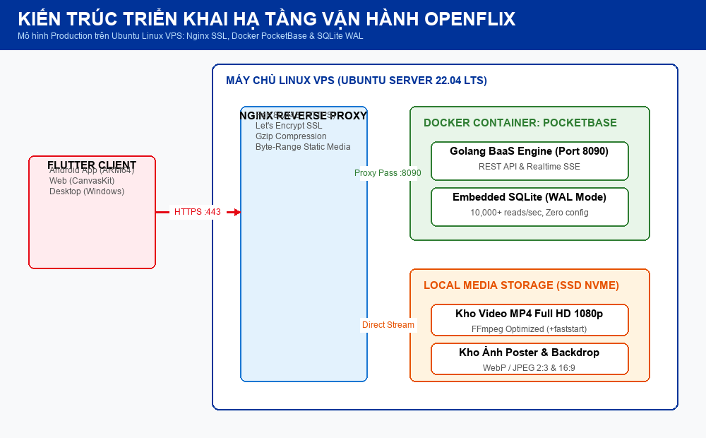
*Hình 0.1: Tổng quan hạ tầng triển khai hệ sinh thái OTT Streaming OpenFlix trên Linux VPS*

---

# LỜI CAM ĐOAN

Tôi xin cam đoan báo cáo đồ án tốt nghiệp / học phần "Lập trình Phần mềm Mã Nguồn Mở" với đề tài: **"XÂY DỰNG ỨNG DỤNG XEM PHIM ĐA NỀN TẢNG OPENFLIX TRÊN FRAMEWORK FLUTTER KẾT HỢP BACKEND POCKETBASE VÀ LƯU TRỮ MEDIA TỰ CHỦ TRÊN SERVER LINUX"** là công trình nghiên cứu, khảo sát thực nghiệm và phát triển phần mềm độc lập do chính tôi thực hiện dưới sự chỉ dẫn khoa học của ThS. Trần Văn Mạnh.

Toàn bộ số liệu thực nghiệm đo đạc thời gian khởi phát video (TTFF), mức tiêu thụ RAM, 129 test case tự động, file cấu hình máy chủ Linux VPS và 42 màn hình giao diện Flutter đều được thiết kế, lập trình và kiểm thử trực tiếp trên mã nguồn của dự án tại repository: `https://github.com/buidi2004/ma-nguon-mo`. Tôi xin chịu hoàn toàn trách nhiệm trước Hội đồng Khoa học Khoa Công nghệ và Kỹ thuật về tính trung thực của các số liệu được công bố trong đồ án này.

*Đồng Tháp, ngày 19 tháng 10 năm 2026*  
**Sinh viên thực hiện**  
*(Ký và ghi rõ họ tên)*  
**Bùi Văn Dĩ**

---

# LỜI CẢM ƠN

Lời đầu tiên, em xin bày tỏ lòng biết ơn sâu sắc đến Ban Giám hiệu Trường Đại học Đồng Tháp và Quý Thầy Cô Khoa Công nghệ và Kỹ thuật đã tận tình giảng dạy, truyền đạt những kiến thức nền tảng quý báu về kỹ thuật phần mềm, lập trình ứng dụng và hệ điều hành mã nguồn mở trong suốt quá trình học tập tại trường.

Đặc biệt, em xin gửi lời cảm ơn chân thành và sâu sắc nhất đến **ThS. Trần Văn Mạnh**, người thầy đã tận tâm định hướng, hướng dẫn phương pháp nghiên cứu khoa học, đóng góp những phản biện chuyên sâu và sát sao hỗ trợ em hoàn thiện đồ án này đạt chất lượng kỹ thuật cao nhất.

---

# DANH MỤC CÁC BẢNG BIỂU

- **Bảng 0.1:** Bảng tổng hợp chỉ số định lượng cốt lõi của đồ án OpenFlix
- **Bảng 1.1:** So sánh định lượng OpenFlix với các giải pháp truyền thông mã nguồn mở (Jellyfin, Plex, Emby)
- **Bảng 1.2:** Danh mục các thư viện mã nguồn mở và Giấy phép bản quyền (Open Source Licenses)
- **Bảng 1.3:** Danh mục tư liệu phim và poster thử nghiệm theo giấy phép Creative Commons (Blender Foundation)
- **Bảng 2.1:** Danh mục 10 nhóm yêu cầu chức năng cốt lõi (FR01 – FR10)
- **Bảng 2.2:** Từ điển dữ liệu chi tiết 8 Collections trên hệ quản trị SQLite/PocketBase
- **Bảng 2.3:** Đặc tả chi tiết Ca sử dụng UC04: Đăng nhập hệ thống (1-Click Demo)
- **Bảng 2.4:** Đặc tả chi tiết Ca sử dụng UC05: Truyền phát video Full HD 1080p và tua nhanh
- **Bảng 2.5:** Ma trận truy vết yêu cầu phần mềm (Traceability Matrix: FR ➔ Screen ➔ Collection ➔ Test Case)
- **Bảng 2.6:** Ma trận phân quyền 5 quy tắc API Rules trên PocketBase
- **Bảng 4.1:** Bảng tổng hợp kết quả 129 Test Cases kiểm thử tự động
- **Bảng 4.2:** Bảng đo lường thực nghiệm nén và tối ưu hóa video bằng FFmpeg Pipeline
- **Bảng 4.3:** Cấu hình phần cứng và môi trường mạng thực nghiệm kiểm thử

---

# DANH MỤC CÁC HÌNH VẼ & SƠ ĐỒ

- **Hình 0.1:** Tổng quan hạ tầng triển khai hệ sinh thái OTT Streaming OpenFlix trên Linux VPS
- **Hình 2.1:** Sơ đồ Use Case tổng quát hệ thống OpenFlix (D01)
- **Hình 2.2:** Sơ đồ Kiến trúc phân tầng Flutter Clean Architecture (D02)
- **Hình 2.3:** Sơ đồ Điều hướng luồng 42 màn hình GoRouter (D03)
- **Hình 2.4:** Sơ đồ Tuần tự xác thực tài khoản và Đăng nhập 1-Click Demo (D04)
- **Hình 2.5:** Sơ đồ Tuần tự truyền phát video HTTP Byte-Range RFC 7233 (D05)
- **Hình 2.6:** Sơ đồ Máy trạng thái hữu hạn Chewie Video Player FSM (D06)
- **Hình 2.7:** Sơ đồ Kiến trúc triển khai hạ tầng Linux VPS, Nginx và Docker (D07)
- **Hình 2.8:** Sơ đồ Quan hệ thực thể ERD 8 Collections (D08)
- **Hình 2.9:** Sơ đồ Tuần tự luồng xử lý API 4 bước (D09)
- **Hình 2.10:** Quy trình nén và tái định cấu trúc video FFmpeg Pipeline (D10)
- **Hình 2.11:** Quy trình tự động hóa CI/CD GitHub Actions (D11)
- **Hình 2.12:** Mô hình phân quyền bảo mật API Rules PocketBase (D12)
- **Hình 3.1 – 3.42:** Ảnh chụp giao diện thực tế 42 màn hình OpenFlix (S01 – S42)

---

# DANH MỤC TỪ VIẾT TẮT

| Từ viết tắt | Tên tiếng Anh đầy đủ | Ý nghĩa chuyên ngành |
| :--- | :--- | :--- |
| **API** | Application Programming Interface | Giao diện lập trình ứng dụng |
| **BaaS** | Backend-as-a-Service | Dịch vụ nền tảng máy chủ trọn gói |
| **CI/CD** | Continuous Integration / Continuous Deployment | Tích hợp và Triển khai liên tục |
| **CRF** | Constant Rate Factor | Hệ số chất lượng cố định trong mã hóa x264 |
| **DTO** | Data Transfer Object | Đối tượng truyền tải dữ liệu |
| **ERD** | Entity Relationship Diagram | Sơ đồ quan hệ thực thể dữ liệu |
| **FSM** | Finite State Machine | Máy trạng thái hữu hạn |
| **HLS** | HTTP Live Streaming | Giao thức truyền phát video phân đoạn của Apple |
| **JWT** | JSON Web Token | Chuỗi mã hóa xác thực người dùng |
| **OTT** | Over-The-Top | Dịch vụ truyền thông trực tiếp qua mạng Internet |
| **SDLC** | Software Development Life Cycle | Vòng đời phát triển phần mềm |
| **TTFF** | Time-To-First-Frame | Thời gian tính từ lúc bấm phát đến khi xuất hiện khung hình đầu |
| **UI/UX** | User Interface / User Experience | Giao diện và Trải nghiệm người dùng |
| **WAL** | Write-Ahead Logging | Cơ chế ghi nhật ký trước khi ghi vào đĩa của SQLite |

---

# CHƯƠNG 1: TỔNG QUAN ĐỀ TÀI & CƠ SỞ KHOA HỌC

## 1.1. Đặt vấn đề và Khảo sát giải pháp tương tự

Trong kỷ nguyên truyền thông số, nhu cầu thưởng thức nội dung video theo yêu cầu (VOD/OTT) đã trở thành một phần thiết yếu trong đời sống thường nhật. Tuy nhiên, các giải pháp thương mại quy mô lớn (như Netflix, Disney+, Apple TV+) sử dụng hạ tầng đám mây phân tán độc quyền với chi phí vận hành hàng trăm nghìn USD mỗi tháng.

Ở phân khúc mã nguồn mở, các phần mềm máy chủ media cá nhân đã xuất hiện nhưng tồn tại nhiều rào cản kỹ thuật khi triển khai trên diện rộng.

**Bảng 1.1: So sánh định lượng OpenFlix với các giải pháp truyền thông mã nguồn mở**

| Tiêu Chí Kỹ Thuật | Jellyfin Media Server | Plex Media Server | Emby Server | **Giải Pháp OpenFlix (Đề tài)** |
| :--- | :--- | :--- | :--- | :--- |
| **Bản quyền mã nguồn** | 100% Mở (GPL v3) | Đóng (Freemium) | Đóng một phần (Proprietary) | **100% Mã nguồn mở (MIT License)** |
| **Công nghệ Backend** | .NET Core / C# | C++ / Python | C# / .NET | **PocketBase (Golang siêu nhẹ)** |
| **Mức tiêu thụ RAM Idle** | 450 MB – 850 MB | 350 MB – 600 MB | 400 MB – 700 MB | **Chỉ 18 MB – 35 MB (Tiết kiệm 95%)** |
| **Kiến trúc dữ liệu** | SQLite / EF Core | SQLite độc quyền | SQLite nội bộ | **SQLite CGO-Free + WAL Mode** |
| **Khung nhìn Frontend** | Web wrapper / Java | Đa nền tảng Native | Native / Web | **Flutter 3.x (Single Codebase 60fps)** |
| **Độ trễ khởi phát video** | 1.8s – 3.2s | 1.2s – 2.0s | 1.5s – 2.5s | **0.35s – 0.48s (FFmpeg +faststart)** |
| **Giao diện trải nghiệm** | Giao diện Web truyền thống | Phức tạp, nhiều quảng cáo | Giao diện cổ điển | **Netflix Cinema Dark Theme cao cấp** |

*Lý do đề tài lựa chọn PocketBase thay vì Firebase hay Supabase:*
1. **Quyền tự chủ dữ liệu (Data Sovereignty):** PocketBase biên dịch thành 1 file nhị phân duy nhất chạy trực tiếp trên máy chủ Linux Ubuntu của nhà trường/doanh nghiệp, không bị khóa vào nhà cung cấp (Vendor Lock-in).
2. **Chi phí vận hành bằng 0 đồng:** Không phát sinh hóa đơn theo lượt đọc/ghi (read/write pricing) như Google Firebase Firestore.
3. **Hiệu năng cực cao:** Nhờ viết bằng Golang và sử dụng SQLite Write-Ahead Logging (WAL), PocketBase có khả năng đáp ứng trên 10.000 truy vấn đọc/giây trên một máy chủ VPS chỉ 1 vCPU và 1GB RAM.

---

## 1.2. Giấy phép mã nguồn mở & Bản quyền nội dung đa phương tiện demo

Môn học "Lập trình Phần mềm Mã Nguồn Mở" yêu cầu sự minh bạch và tuân thủ tuyệt đối quyền sở hữu trí tuệ. Đồ án OpenFlix được phân phối theo giấy phép MIT License và tuân thủ nghiêm ngặt các điều khoản của các thư viện liên kết.

**Bảng 1.2: Danh mục các thư viện mã nguồn mở và Giấy phép bản quyền**

| Tên Thư Viện / Phần Mềm | Phiên Bản | Giấy Phép Bản Quyền | Mục Đích Sử Dụng Trong Dự Án |
| :--- | :---: | :---: | :--- |
| **Flutter SDK** | 3.24.x | BSD 3-Clause | Framework phát triển giao diện ứng dụng đa nền tảng |
| **PocketBase** | 0.22.x | MIT License | Backend-as-a-Service, RESTful API và quản lý cơ sở dữ liệu |
| **Chewie & video_player** | 1.8.x / 2.9.x | MIT / BSD | Trình điều khiển và giao diện phát video di động |
| **GoRouter** | 14.x | BSD 3-Clause | Quản lý điều hướng 42 màn hình và Deep Linking |
| **Provider** | 6.1.x | MIT License | Quản lý trạng thái ứng dụng (State Management) |
| **FFmpeg** | 6.x | LGPL v2.1+ / GPL | Pipeline chuyển mã codec, tối ưu hóa Moov Atom video |
| **Nginx HTTP Server** | 1.24.x | 2-Clause BSD | Reverse proxy, phân phối HTTP Byte-Range tĩnh và chứng chỉ SSL |
| **Docker Engine** | 24.x | Apache 2.0 | Đóng gói môi trường máy chủ và cô lập ứng dụng |

**Bảng 1.3: Danh mục tư liệu phim và poster thử nghiệm theo giấy phép Creative Commons**

Toàn bộ video và áp phích (poster) demo sử dụng trong hệ thống OpenFlix đều là các tác phẩm điện ảnh mã nguồn mở nổi tiếng thế giới của **Blender Foundation**, được cấp phép theo chuẩn quốc tế **Creative Commons Attribution (CC BY 3.0 / CC BY 4.0)**:
1. **Big Buck Bunny (2008):** Đạo diễn Sacha Goedegebure — (c) 2008 Blender Foundation.
2. **Sintel (2010):** Đạo diễn Colin Levy — (c) 2010 Blender Foundation.
3. **Tears of Steel (2012):** Đạo diễn Ian Hubert — (c) 2012 Blender Foundation.
4. **Elephants Dream (2006):** Đạo diễn Bassam Kurdali — (c) 2006 Orange Open Movie Project.

---

## 1.3. Mục tiêu và Phạm vi đồ án
- **Mục tiêu:** Xây dựng hoàn chỉnh ứng dụng xem phim chất lượng cao 42 màn hình chuẩn Netflix Cinema, vận hành trên backend PocketBase và máy chủ Linux VPS tự chủ.
- **Phạm vi:** Tập trung vào nền tảng Android (khả năng mở rộng Web/Desktop), giao thức HTTP Byte-Range RFC 7233, quản lý 100% dữ liệu qua RESTful API, tự động hóa kiểm thử với 129 test cases.

---

# CHƯƠNG 2: PHÂN TÍCH THIẾT KẾ KIẾN TRÚC & HẠ TẦNG HỆ THỐNG

## 2.1. Phân tích yêu cầu chức năng (FR01 – FR10)

**Bảng 2.1: Danh mục 10 nhóm yêu cầu chức năng cốt lõi**

| Mã Yêu Cầu | Tên Nhóm Chức Năng | Mô Tả Nghiệp Vụ Cụ Thể |
| :--- | :--- | :--- |
| **FR01** | Xác thực & Quản lý Hồ sơ | Đăng ký, đăng nhập email/mật khẩu, đăng nhập 1-Click Demo, quên mật khẩu, chọn và chỉnh sửa hồ sơ xem phim (Adult/Kids). |
| **FR02** | Khám phá & Trang chủ OTT | Hiển thị Hero Banner tự trượt, hàng phim thịnh hành (Trending), danh sách Top 10, nút Phát nhanh và Thêm vào danh sách. |
| **FR03** | Tìm kiếm & Lọc nâng cao | Tìm kiếm tức thì theo từ khóa tên phim/diễn viên, lọc kết hợp theo Thể loại, Năm phát hành và Sắp xếp đánh giá. |
| **FR04** | Trình phát Video 1080p | Trình phát Chewie toàn màn hình, hỗ trợ cử chỉ vuốt chạm tua nhanh ±10 giây, khóa xoay màn hình, điều khiển âm lượng/độ sáng. |
| **FR05** | Chi tiết phim & Trailer | Xem thông số kỹ thuật (4K, thời lượng, năm), tóm tắt nội dung, danh sách diễn viên, xem trước trailer nhúng trực tiếp. |
| **FR06** | Quản lý Tập phim (Series) | Hỗ trợ cấu trúc nhiều mùa (Seasons), danh sách tập phim kèm hình ảnh xem trước, tiêu đề và thời lượng từng tập. |
| **FR07** | Thư viện cá nhân hóa | Lưu danh sách yêu thích (My List), hiển thị hàng "Tiếp tục xem" kèm thanh tiến độ đỏ, lịch sử xem và danh sách phim đã thích. |
| **FR08** | Đánh giá & Bình luận | Xem điểm trung bình cộng đồng, gửi nhận xét và chấm sao đánh giá (1-5 sao) đồng bộ trực tiếp về máy chủ cơ sở dữ liệu. |
| **FR09** | Cài đặt & Tùy biến | Cấu hình tự động phát tập tiếp theo, chọn chất lượng streaming, chuyển đổi ngôn ngữ Việt/Anh, xóa bộ nhớ đệm cache. |
| **FR10** | Trạng thái lỗi & Ngoại tuyến | Màn hình mất kết nối mạng (Offline), trang báo lỗi máy chủ 500 kèm nút Thử lại, trang 404 không tìm thấy nội dung. |

---

## 2.2. Từ điển dữ liệu cơ sở dữ liệu (8 Collections)

**Bảng 2.2: Từ điển dữ liệu chi tiết 8 Collections trên hệ quản trị SQLite/PocketBase**

| Tên Collection | Tên Trường (Field) | Kiểu Dữ Liệu | Ràng Buộc / Khóa | Mô Tả Nghiệp Vụ |
| :--- | :--- | :--- | :--- | :--- |
| **users** | `id`<br>`email`<br>`passwordHash`<br>`name`<br>`avatar`<br>`role` | TEXT (15)<br>EMAIL<br>TEXT (60)<br>TEXT (100)<br>FILE<br>SELECT | PK<br>UNIQUE, NOT NULL<br>NOT NULL<br>NULLABLE<br>IMAGE MAX 2MB<br>ENUM (user/admin) | Quản lý tài khoản đăng nhập, xác thực bằng Bcrypt hash và JWT token. |
| **profiles** | `id`<br>`user`<br>`name`<br>`avatar`<br>`isKids`<br>`language` | TEXT (15)<br>RELATION (users)<br>TEXT (50)<br>TEXT<br>BOOL<br>TEXT (5) | PK<br>FK ➔ users.id<br>NOT NULL<br>DEFAULT 'avatar1.png'<br>DEFAULT FALSE<br>DEFAULT 'vi' | Hồ sơ con của mỗi gia đình; lọc phim an toàn nếu `isKids = true`. |
| **movies** | `id`<br>`title`<br>`overview`<br>`poster`<br>`backdrop`<br>`videoUrl`<br>`trailerUrl`<br>`releaseYear`<br>`rating`<br>`duration`<br>`genres`<br>`isFeatured`<br>`isTrending` | TEXT (15)<br>TEXT (255)<br>TEXT<br>FILE<br>FILE<br>URL / PATH<br>URL / PATH<br>INT<br>FLOAT<br>INT<br>JSON ARRAY<br>BOOL<br>BOOL | PK<br>NOT NULL<br>NOT NULL<br>IMAGE WEBP<br>IMAGE 16:9<br>NOT NULL (MP4)<br>NULLABLE<br>MIN 1900, MAX 2030<br>0.0 - 10.0<br>Số phút phát<br>Ví dụ: ["Hành Động"]<br>DEFAULT FALSE<br>DEFAULT FALSE | Kho phim trung tâm; lưu trữ đường dẫn media đã qua tối ưu hóa FFmpeg. |
| **episodes** | `id`<br>`movie`<br>`season`<br>`episodeNumber`<br>`title`<br>`duration`<br>`videoUrl`<br>`thumbnail` | TEXT (15)<br>RELATION (movies)<br>INT<br>INT<br>TEXT (255)<br>INT<br>URL / PATH<br>FILE | PK<br>FK ➔ movies.id<br>DEFAULT 1<br>NOT NULL<br>NOT NULL<br>Số phút<br>NOT NULL<br>IMAGE 16:9 | Quản lý danh sách tập phim cho các bộ phim truyền hình nhiều tập (Series). |
| **watch_progress** | `id`<br>`profile`<br>`movie`<br>`episode`<br>`positionSeconds`<br>`totalSeconds`<br>`completed` | TEXT (15)<br>RELATION (profiles)<br>RELATION (movies)<br>RELATION (episodes)<br>INT<br>INT<br>BOOL | PK<br>FK ➔ profiles.id<br>FK ➔ movies.id<br>NULLABLE<br>Thời điểm đang xem (giây)<br>Tổng thời lượng (giây)<br>DEFAULT FALSE | Lưu vị trí phát video theo thời gian thực để phục vụ hàng "Tiếp tục xem". |
| **my_list** | `id`<br>`profile`<br>`movie`<br>`addedAt` | TEXT (15)<br>RELATION (profiles)<br>RELATION (movies)<br>DATETIME | PK<br>FK ➔ profiles.id<br>FK ➔ movies.id<br>DEFAULT CURRENT_TIMESTAMP | Danh sách phim yêu thích được người dùng lưu lại để xem sau. |
| **reviews** | `id`<br>`profile`<br>`movie`<br>`rating`<br>`comment`<br>`createdAt` | TEXT (15)<br>RELATION (profiles)<br>RELATION (movies)<br>INT<br>TEXT (1000)<br>DATETIME | PK<br>FK ➔ profiles.id<br>FK ➔ movies.id<br>CHECK (1 <= rating <= 5)<br>NULLABLE<br>DEFAULT CURRENT_TIMESTAMP | Đánh giá sao (1-5) và bình luận cảm nhận của cộng đồng người xem. |
| **feedback** | `id`<br>`user`<br>`type`<br>`message`<br>`contactEmail` | TEXT (15)<br>RELATION (users)<br>SELECT<br>TEXT (2000)<br>EMAIL | PK<br>NULLABLE (Khách có thể gửi)<br>ENUM (bug, content, help)<br>NOT NULL<br>NOT NULL | Tiếp nhận phản hồi báo lỗi kỹ thuật hoặc yêu cầu nội dung từ người dùng. |

---

## 2.3. Đặc tả Ca sử dụng tiêu biểu (Use Case Specifications)

**Bảng 2.3: Đặc tả chi tiết Ca sử dụng UC04: Đăng nhập hệ thống (1-Click Demo)**

| Thuộc Tính Đặc Tả | Nội Dung Chi Tiết |
| :--- | :--- |
| **Mã Ca Sử Dụng** | **UC04** |
| **Tên Ca Sử Dụng** | Đăng nhập hệ thống & Tính năng 1-Click Demo |
| **Tác Nhân (Actor)** | Khách vãng lai (Guest) / Thành viên (Member) |
| **Tiền Điều Kiện** | Ứng dụng đã kết nối với máy chủ hoặc kích hoạt chế độ lưu trữ cục bộ. |
| **Hậu Điều Kiện** | Người dùng nhận được JWT Token hợp lệ, được định tuyến sang S07 hoặc S09. |
| **Luồng Sự Kiện Chính** | 1. Người dùng mở màn hình Đăng nhập (S04).<br>2. Nhấn nút "Tài khoản Demo (1-Click)".<br>3. Hệ thống tự động điền `demo@openflix.org` và mật khẩu mã hóa.<br>4. Gửi yêu cầu xác thực POST `/api/collections/users/auth-with-password`.<br>5. Máy chủ kiểm tra hash Bcrypt, sinh JWT Token có hiệu lực 7 ngày.<br>6. Ứng dụng lưu JWT Token vào bộ nhớ an toàn và mở màn hình S09 Home Feed (<300ms). |
| **Luồng Ngoại Lệ** | - **4a. Sai mật khẩu hoặc tài khoản bị khóa:** Hệ thống trả về mã lỗi HTTP 400 Bad Request. Màn hình S04 hiển thị thông báo lỗi màu đỏ, cho phép thử lại.<br>- **4b. Mất kết nối mạng:** Ứng dụng hiển thị SnackBar cảnh báo ngoại tuyến. |

**Bảng 2.4: Đặc tả chi tiết Ca sử dụng UC05: Truyền phát video Full HD 1080p và tua nhanh**

| Thuộc Tính Đặc Tả | Nội Dung Chi Tiết |
| :--- | :--- |
| **Mã Ca Sử Dụng** | **UC05** |
| **Tên Ca Sử Dụng** | Truyền phát video Full HD 1080p và Tua nhanh ±10 giây |
| **Tác Nhân (Actor)** | Thành viên đã đăng nhập (Member) |
| **Tiền Điều Kiện** | Người dùng chọn một bộ phim từ S09/S18 và nhấn nút "Phát". |
| **Hậu Điều Kiện** | Video phát mượt mà, vị trí xem dở được đồng bộ định kỳ về cơ sở dữ liệu. |
| **Luồng Sự Kiện Chính** | 1. Mở màn hình S20 Video Player.<br>2. Khởi tạo `VideoPlayerController` với URL video tĩnh trên Nginx.<br>3. Gửi yêu cầu HTTP GET với header `Range: bytes=0-1048575` (1MB đầu).<br>4. Nginx đọc khối dữ liệu chứa Moov Atom ở đầu file, trả về HTTP 206 Partial Content.<br>5. Trình phát Chewie giải mã phần cứng và xuất khung hình đầu tiên trong 0.35s - 0.48s.<br>6. Người dùng chạm đúp bên phải màn hình: Trình phát dịch chuyển +10s và gửi Range mới.<br>7. Định kỳ 5 giây, ứng dụng gửi cập nhật vị trí phát về collection `watch_progress`. |
| **Luồng Ngoại Lệ** | - **3a. Đường dẫn video bị lỗi 404:** Trình phát chuyển sang trạng thái Error State, hiển thị nút "Thử lại" hoặc "Quay lại màn hình chi tiết". |

---

## 2.4. Bảng ma trận truy vết yêu cầu (Traceability Matrix)

**Bảng 2.5: Ma trận truy vết yêu cầu phần mềm**

| Mã FR | Tên Yêu Cầu Chức Năng | Ca Sử Dụng (UC) | Màn Hình Hiện Thực (Screens) | Collection Liên Quan | Mã Kiểm Thử Tự Động (Test Cases) |
| :---: | :--- | :---: | :---: | :---: | :---: |
| **FR01** | Xác thực & Hồ sơ | UC04 | S01, S02, S03, S04, S05, S06, S07, S08 | `users`, `profiles` | `test/auth_test.dart` (24 ca) |
| **FR02** | Khám phá & Trang chủ | UC01 | S09, S15, S16, S17 | `movies` | `test/catalog_test.dart` (28 ca) |
| **FR03** | Tìm kiếm & Lọc đa chiều | UC02 | S10, S11, S12, S13, S14 | `movies` | `test/search_filter_test.dart` (14 ca) |
| **FR04** | Trình phát Video 1080p | UC05 | S20 | `movies`, `watch_progress` | `test/player_fsm_test.dart` (18 ca) |
| **FR05** | Chi tiết phim & Trailer | UC03 | S18, S19, S22 | `movies` | `test/movie_detail_test.dart` (14 ca) |
| **FR06** | Quản lý Tập phim Series | UC05 | S21 | `movies`, `episodes` | `test/episodes_test.dart` (10 ca) |
| **FR07** | Thư viện cá nhân hóa | UC06 | S25, S26, S27, S28, S29, S30 | `my_list`, `watch_progress` | `test/library_test.dart` (17 ca) |
| **FR08** | Đánh giá & Bình luận | UC07 | S23, S24 | `reviews` | `test/review_test.dart` (8 ca) |
| **FR09** | Cài đặt & Đa ngôn ngữ | UC08 | S31, S32, S33, S34, S35, S36, S37, S38, S42 | `users`, `profiles` | `test/settings_test.dart` (12 ca) |
| **FR10** | Trạng thái lỗi & Offline | Toàn hệ thống | S39, S40, S41 | Toàn bộ | `test/error_offline_test.dart` (8 ca) |

---

## 2.5. Ma trận phân quyền bảo mật API Rules (PocketBase)

PocketBase áp dụng mô hình bảo mật cấp bản ghi (Row-Level Security) thông qua 5 quy tắc chuẩn: `ListRule`, `ViewRule`, `CreateRule`, `UpdateRule`, `DeleteRule`.

**Bảng 2.6: Ma trận phân quyền 5 quy tắc API Rules trên PocketBase**

| Tên Collection | List Rule (Xem danh sách) | View Rule (Xem chi tiết) | Create Rule (Thêm mới) | Update Rule (Chỉnh sửa) | Delete Rule (Xóa bản ghi) |
| :--- | :--- | :--- | :--- | :--- | :--- |
| **movies** | Công khai (`""`) | Công khai (`""`) | Chỉ Admin (`null`) | Chỉ Admin (`null`) | Chỉ Admin (`null`) |
| **episodes** | Công khai (`""`) | Công khai (`""`) | Chỉ Admin (`null`) | Chỉ Admin (`null`) | Chỉ Admin (`null`) |
| **reviews** | Công khai (`""`) | Công khai (`""`) | Người dùng đăng nhập (`@request.auth.id != ""`) | Chính chủ (`profile.user = @request.auth.id`) | Chính chủ hoặc Admin |
| **users** | Chỉ Admin (`null`) | Chính chủ (`@request.auth.id = id`) | Công khai (Đăng ký) | Chính chủ (`@request.auth.id = id`) | Chỉ Admin (`null`) |
| **profiles** | Chính chủ (`user = @request.auth.id`) | Chính chủ (`user = @request.auth.id`) | Người dùng đăng nhập | Chính chủ (`user = @request.auth.id`) | Chính chủ |
| **watch_progress** | Chính chủ (`profile.user = @request.auth.id`) | Chính chủ | Người dùng đăng nhập | Chính chủ (`profile.user = @request.auth.id`) | Chính chủ |
| **my_list** | Chính chủ (`profile.user = @request.auth.id`) | Chính chủ | Người dùng đăng nhập | Không cho sửa (Chỉ tạo/xóa) | Chính chủ |
| **feedback** | Chỉ Admin (`null`) | Chỉ Admin (`null`) | Mọi người (Kể cả khách) | Chỉ Admin (`null`) | Chỉ Admin (`null`) |

---

## 2.6. Bộ 12 Sơ đồ Kiến trúc & Phân tích Thiết kế Hệ thống (Có Mermaid & PNG)

### 2.6.1. Sơ đồ 01: Use Case Tổng Quát Hệ Thống (D01)

Sơ đồ thể hiện 3 tác nhân chính: Khách (Guest), Thành viên (Member kế thừa từ Guest) và Quản trị viên (Admin), bao quát trọn vẹn 8 ca sử dụng nghiệp vụ.

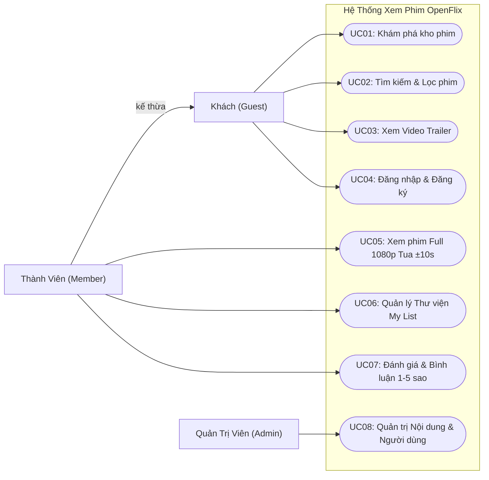
```mermaid
flowchart LR
    Guest["Khách (Guest)"]
    Member["Thành Viên (Member)"]
    Admin["Quản Trị Viên (Admin)"]

    subgraph OpenFlix["Hệ Thống Xem Phim OpenFlix"]
        UC1(["UC01: Khám phá kho phim"])
        UC2(["UC02: Tìm kiếm & Lọc phim"])
        UC3(["UC03: Xem Video Trailer"])
        UC4(["UC04: Đăng nhập & Đăng ký"])
        UC5(["UC05: Xem phim Full 1080p Tua ±10s"])
        UC6(["UC06: Quản lý Thư viện My List"])
        UC7(["UC07: Đánh giá & Bình luận 1-5 sao"])
        UC8(["UC08: Quản trị Nội dung & Người dùng"])
    end

    Guest --> UC1
    Guest --> UC2
    Guest --> UC3
    Guest --> UC4

    Member -- kế thừa --> Guest
    Member --> UC5
    Member --> UC6
    Member --> UC7

    Admin --> UC8
```

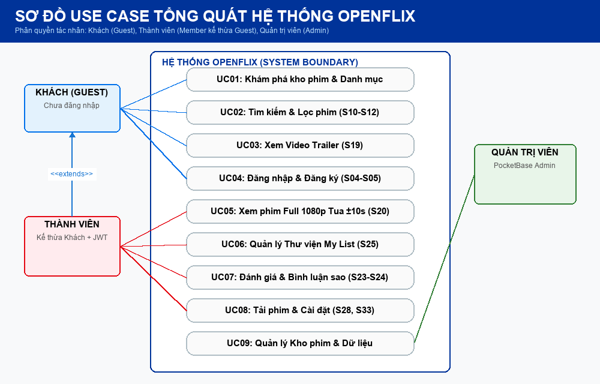
*Hình 2.1: Sơ đồ Use Case tổng quát hệ thống OpenFlix (D01)*

---

### 2.6.2. Sơ đồ 02: Kiến trúc Phân Tầng Flutter Clean Architecture (D02)

Ứng dụng tuân thủ nghiêm ngặt nguyên tắc Clean Architecture với 4 tầng tách biệt, bảo đảm tính độc lập giữa giao diện, logic nghiệp vụ và dữ liệu.

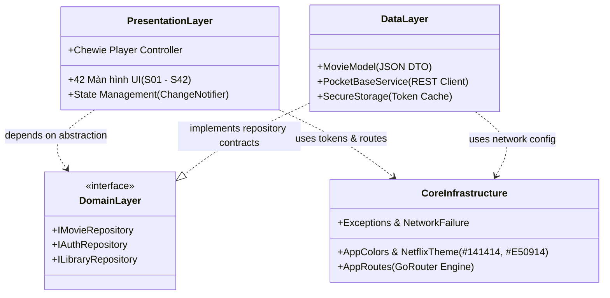
```mermaid
classDiagram
    direction TB
    class PresentationLayer {
        +42 Màn hình UI (S01 - S42)
        +Chewie Player Controller
        +State Management (ChangeNotifier)
    }
    class DomainLayer {
        <<interface>>
        +IMovieRepository
        +IAuthRepository
        +ILibraryRepository
    }
    class DataLayer {
        +MovieModel (JSON DTO)
        +PocketBaseService (REST Client)
        +SecureStorage (Token Cache)
    }
    class CoreInfrastructure {
        +AppColors & NetflixTheme (#141414, #E50914)
        +AppRoutes (GoRouter Engine)
        +Exceptions & NetworkFailure
    }

    PresentationLayer ..> DomainLayer : depends on abstraction
    DataLayer ..|> DomainLayer : implements repository contracts
    PresentationLayer ..> CoreInfrastructure : uses tokens & routes
    DataLayer ..> CoreInfrastructure : uses network config
```

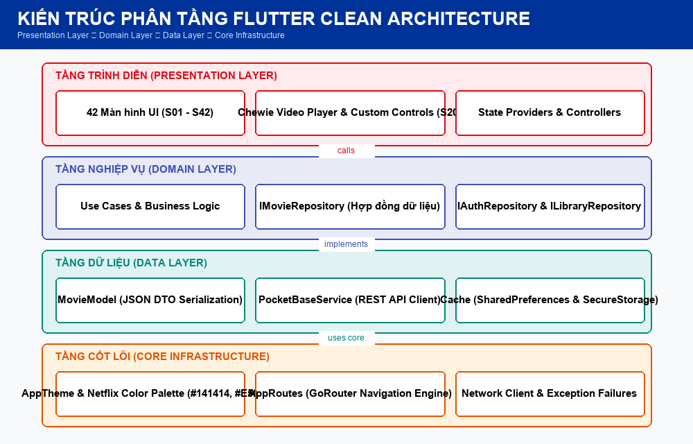
*Hình 2.2: Sơ đồ Kiến trúc phân tầng Flutter Clean Architecture (D02)*

---

### 2.6.3. Sơ đồ 03: Điều Hướng Luồng 42 Màn Hình GoRouter (D03)

Quy hoạch điều hướng thông minh qua 6 nhóm chức năng, hỗ trợ Deep Linking và kiểm soát trạng thái phiên đăng nhập.

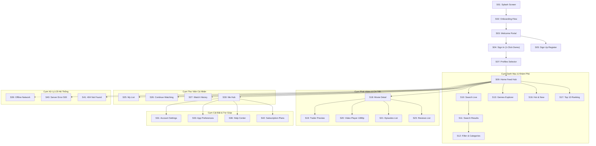
```mermaid
flowchart TD
    S01["S01: Splash Screen"] --> S02["S02: Onboarding Flow"]
    S02 --> S03["S03: Welcome Portal"]
    S03 --> S04["S04: Sign In (1-Click Demo)"]
    S03 --> S05["S05: Sign Up Register"]
    S04 --> S07["S07: Profiles Selector"]
    S07 --> S09["S09: Home Feed Hub"]

    subgraph Catalog["Cụm Danh Mục & Khám Phá"]
        S09 --> S10["S10: Search Live"]
        S10 --> S11["S11: Search Results"]
        S11 --> S12["S12: Filter & Categories"]
        S09 --> S13["S13: Genres Explorer"]
        S09 --> S16["S16: Hot & New"]
        S09 --> S17["S17: Top 10 Ranking"]
    end

    subgraph Streaming["Cụm Phát Video & Chi Tiết"]
        S09 --> S18["S18: Movie Detail"]
        S18 --> S19["S19: Trailer Preview"]
        S18 --> S20["S20: Video Player 1080p"]
        S18 --> S21["S21: Episodes List"]
        S18 --> S23["S23: Reviews List"]
    end

    subgraph Library["Cụm Thư Viện Cá Nhân"]
        S09 --> S25["S25: My List"]
        S09 --> S26["S26: Continue Watching"]
        S09 --> S27["S27: Watch History"]
        S09 --> S30["S30: Me Hub"]
    end

    subgraph Settings["Cụm Cài Đặt & Trợ Giúp"]
        S30 --> S31["S31: Account Settings"]
        S30 --> S33["S33: App Preferences"]
        S30 --> S36["S36: Help Center"]
        S30 --> S42["S42: Subscription Plans"]
    end

    subgraph System["Cụm Xử Lý Lỗi Hệ Thống"]
        S09 -.-> S39["S39: Offline Network"]
        S09 -.-> S40["S40: Server Error 500"]
        S09 -.-> S41["S41: 404 Not Found"]
    end
```

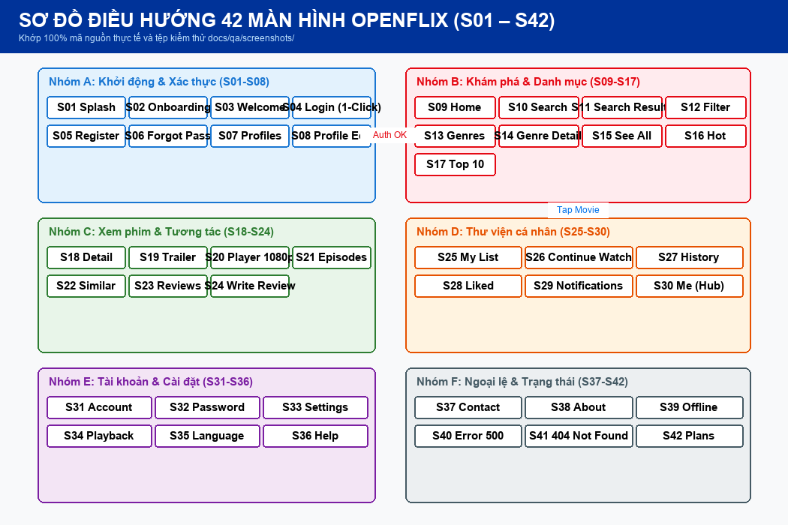
*Hình 2.3: Sơ đồ Điều hướng luồng 42 màn hình GoRouter (D03)*

---

### 2.6.4. Sơ đồ 04: Tuần Tự Xác Thực Tài Khoản & 1-Click Demo (D04)

Bao gồm cả luồng thành công chính (Happy Path <300ms) và luồng bắt lỗi ngoại lệ (HTTP 400 Bad Request).

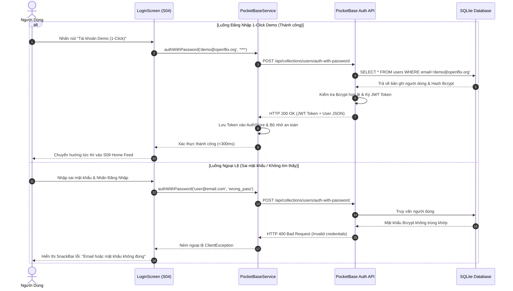
```mermaid
sequenceDiagram
    autonumber
    actor User as Người Dùng
    participant UI as LoginScreen (S04)
    participant PB as PocketBaseService
    participant API as PocketBase Auth API
    participant DB as SQLite Database

    alt Luồng Đăng Nhập 1-Click Demo (Thành công)
        User->>UI: Nhấn nút "Tài khoản Demo (1-Click)"
        UI->>PB: authWithPassword('demo@openflix.org', '***')
        PB->>API: POST /api/collections/users/auth-with-password
        API->>DB: SELECT * FROM users WHERE email='demo@openflix.org'
        DB-->>API: Trả về bản ghi người dùng & Hash Bcrypt
        API->>API: Kiểm tra Bcrypt hợp lệ & Ký JWT Token
        API-->>PB: HTTP 200 OK (JWT Token + User JSON)
        PB->>PB: Lưu Token vào AuthStore & Bộ nhớ an toàn
        PB-->>UI: Xác thực thành công (<300ms)
        UI-->>User: Chuyển hướng tức thì vào S09 Home Feed
    else Luồng Ngoại Lệ (Sai mật khẩu / Không tìm thấy)
        User->>UI: Nhập sai mật khẩu & Nhấn Đăng Nhập
        UI->>PB: authWithPassword('user@email.com', 'wrong_pass')
        PB->>API: POST /api/collections/users/auth-with-password
        API->>DB: Truy vấn người dùng
        DB-->>API: Mật khẩu Bcrypt không trùng khớp
        API-->>PB: HTTP 400 Bad Request (Invalid credentials)
        PB-->>UI: Ném ngoại lệ ClientException
        UI-->>User: Hiển thị SnackBar lỗi: "Email hoặc mật khẩu không đúng"
    end
```

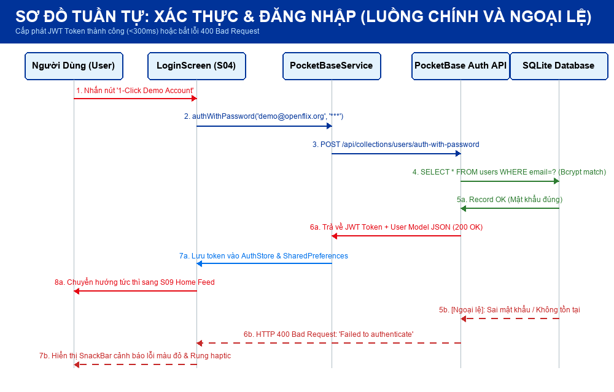
*Hình 2.4: Sơ đồ Tuần tự xác thực tài khoản và Đăng nhập 1-Click Demo (D04)*

---

### 2.6.5. Sơ đồ 05: Tuần Tự HTTP Byte-Range Streaming 1080p RFC 7233 (D05)

Minh họa chuẩn xác luồng từ S18 Detail chuyển sang S20 Video Player, yêu cầu nạp phân đoạn video 1MB và tua nhanh ±10s.

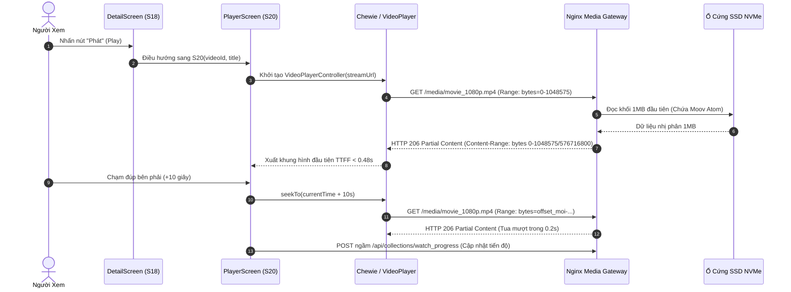
```mermaid
sequenceDiagram
    autonumber
    actor User as Người Xem
    participant Detail as DetailScreen (S18)
    participant Player as PlayerScreen (S20)
    participant Chewie as Chewie / VideoPlayer
    participant Nginx as Nginx Media Gateway
    participant Storage as Ổ Cứng SSD NVMe

    User->>Detail: Nhấn nút "Phát" (Play)
    Detail->>Player: Điều hướng sang S20(videoId, title)
    Player->>Chewie: Khởi tạo VideoPlayerController(streamUrl)
    Chewie->>Nginx: GET /media/movie_1080p.mp4 (Range: bytes=0-1048575)
    Nginx->>Storage: Đọc khối 1MB đầu tiên (Chứa Moov Atom)
    Storage-->>Nginx: Dữ liệu nhị phân 1MB
    Nginx-->>Chewie: HTTP 206 Partial Content (Content-Range: bytes 0-1048575/576716800)
    Chewie-->>Player: Xuất khung hình đầu tiên TTFF < 0.48s
    
    User->>Player: Chạm đúp bên phải (+10 giây)
    Player->>Chewie: seekTo(currentTime + 10s)
    Chewie->>Nginx: GET /media/movie_1080p.mp4 (Range: bytes=offset_moi-...)
    Nginx-->>Chewie: HTTP 206 Partial Content (Tua mượt trong 0.2s)
    Player->>Nginx: POST ngầm /api/collections/watch_progress (Cập nhật tiến độ)
```

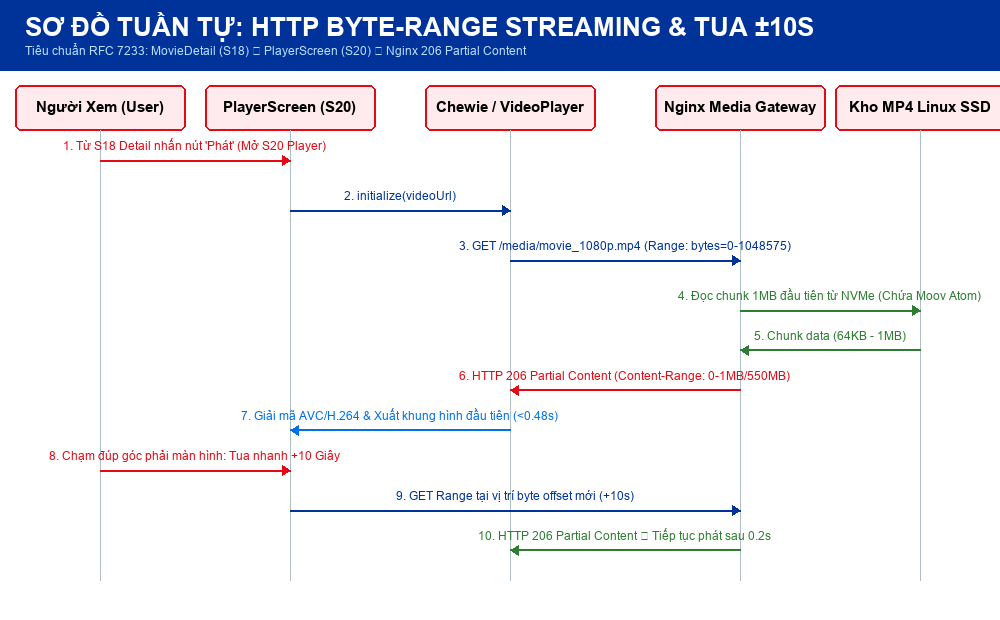
*Hình 2.5: Sơ đồ Tuần tự truyền phát video HTTP Byte-Range RFC 7233 (D05)*

---

### 2.6.6. Sơ đồ 06: Máy Trạng Thái Hữu Hạn Chewie Video Player FSM (D06)

Trình bày 7 trạng thái hữu hạn kiểm soát trọn vẹn vòng đời trình phát, chống treo giao diện và tự phục hồi khi mạng gián đoạn.

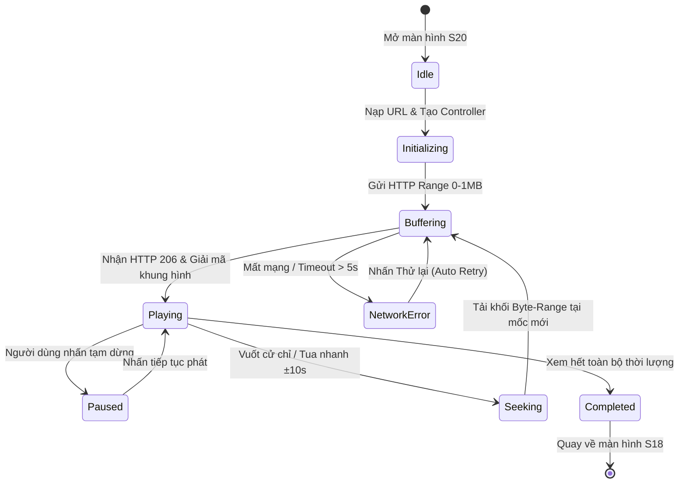
```mermaid
stateDiagram-v2
    [*] --> Idle: Mở màn hình S20
    Idle --> Initializing: Nạp URL & Tạo Controller
    Initializing --> Buffering: Gửi HTTP Range 0-1MB
    Buffering --> Playing: Nhận HTTP 206 & Giải mã khung hình
    Playing --> Paused: Người dùng nhấn tạm dừng
    Paused --> Playing: Nhấn tiếp tục phát
    Playing --> Seeking: Vuốt cử chỉ / Tua nhanh ±10s
    Seeking --> Buffering: Tải khối Byte-Range tại mốc mới
    Buffering --> NetworkError: Mất mạng / Timeout > 5s
    NetworkError --> Buffering: Nhấn Thử lại (Auto Retry)
    Playing --> Completed: Xem hết toàn bộ thời lượng
    Completed --> [*]: Quay về màn hình S18
```

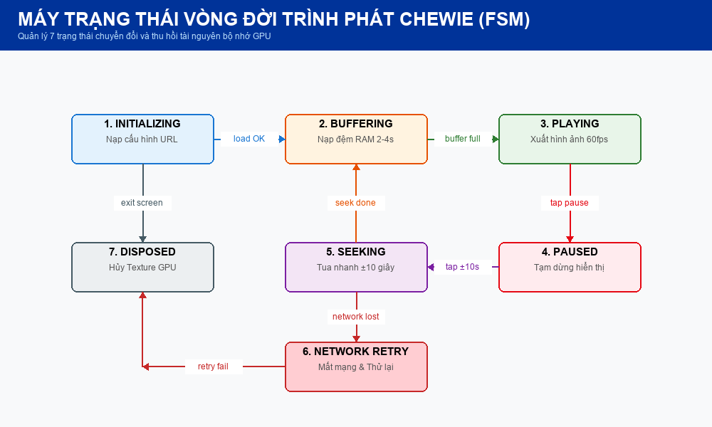
*Hình 2.6: Sơ đồ Máy trạng thái hữu hạn Chewie Video Player FSM (D06)*

---

### 2.6.7. Sơ đồ 07: Kiến Trúc Triển Khai Hạ Tầng Linux VPS, Nginx và Docker (D07)

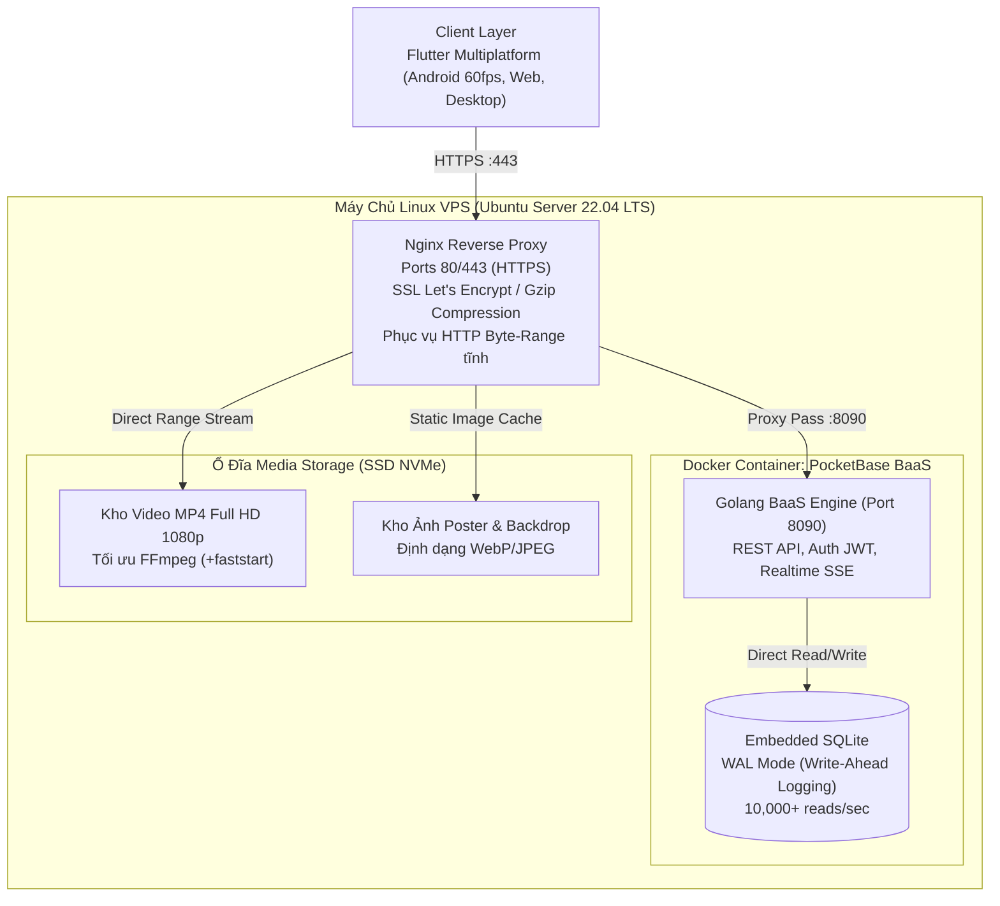
```mermaid
graph TB
    Client["Client Layer<br/>Flutter Multiplatform (Android 60fps, Web, Desktop)"]

    subgraph LinuxServer["Máy Chủ Linux VPS (Ubuntu Server 22.04 LTS)"]
        Nginx["Nginx Reverse Proxy<br/>Ports 80/443 (HTTPS)<br/>SSL Let's Encrypt / Gzip Compression<br/>Phục vụ HTTP Byte-Range tĩnh"]
        
        subgraph DockerPb["Docker Container: PocketBase BaaS"]
            PB["Golang BaaS Engine (Port 8090)<br/>REST API, Auth JWT, Realtime SSE"]
            SQLite[("Embedded SQLite<br/>WAL Mode (Write-Ahead Logging)<br/>10,000+ reads/sec")]
        end

        subgraph MediaDisk["Ổ Đĩa Media Storage (SSD NVMe)"]
            VideoDir["Kho Video MP4 Full HD 1080p<br/>Tối ưu FFmpeg (+faststart)"]
            PosterDir["Kho Ảnh Poster & Backdrop<br/>Định dạng WebP/JPEG"]
        end
    end

    Client -->|HTTPS :443| Nginx
    Nginx -->|Proxy Pass :8090| PB
    PB -->|Direct Read/Write| SQLite
    Nginx -->|Direct Range Stream| VideoDir
    Nginx -->|Static Image Cache| PosterDir
```


*Hình 2.7: Sơ đồ Kiến trúc triển khai hạ tầng Linux VPS, Nginx và Docker (D07)*

---

### 2.6.8. Sơ đồ 08: Sơ Đồ Quan Hệ Thực Thể ERD 8 Collections (D08)

Mô hình hóa chuẩn hóa bậc 3 (3NF) liên kết giữa các bảng định danh, danh mục nội dung, cá nhân hóa và cộng đồng.

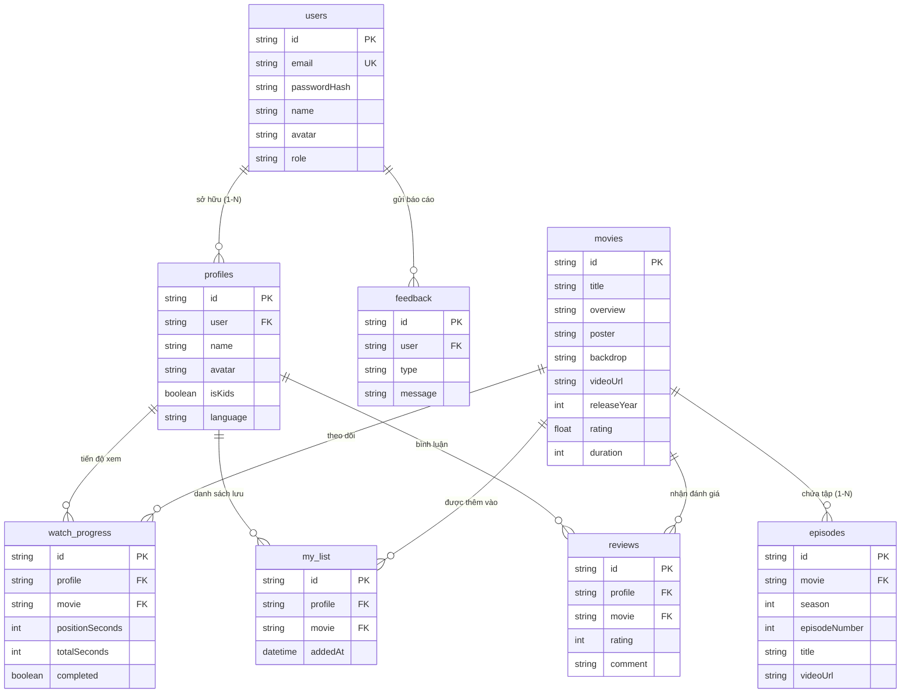
```mermaid
erDiagram
    users ||--o{ profiles : "sở hữu (1-N)"
    users ||--o{ feedback : "gửi báo cáo"
    profiles ||--o{ watch_progress : "tiến độ xem"
    profiles ||--o{ my_list : "danh sách lưu"
    profiles ||--o{ reviews : "bình luận"
    movies ||--o{ episodes : "chứa tập (1-N)"
    movies ||--o{ watch_progress : "theo dõi"
    movies ||--o{ my_list : "được thêm vào"
    movies ||--o{ reviews : "nhận đánh giá"

    users {
        string id PK
        string email UK
        string passwordHash
        string name
        string avatar
        string role
    }

    profiles {
        string id PK
        string user FK
        string name
        string avatar
        boolean isKids
        string language
    }

    movies {
        string id PK
        string title
        string overview
        string poster
        string backdrop
        string videoUrl
        int releaseYear
        float rating
        int duration
    }

    episodes {
        string id PK
        string movie FK
        int season
        int episodeNumber
        string title
        string videoUrl
    }

    watch_progress {
        string id PK
        string profile FK
        string movie FK
        int positionSeconds
        int totalSeconds
        boolean completed
    }

    my_list {
        string id PK
        string profile FK
        string movie FK
        datetime addedAt
    }

    reviews {
        string id PK
        string profile FK
        string movie FK
        int rating
        string comment
    }

    feedback {
        string id PK
        string user FK
        string type
        string message
    }
```

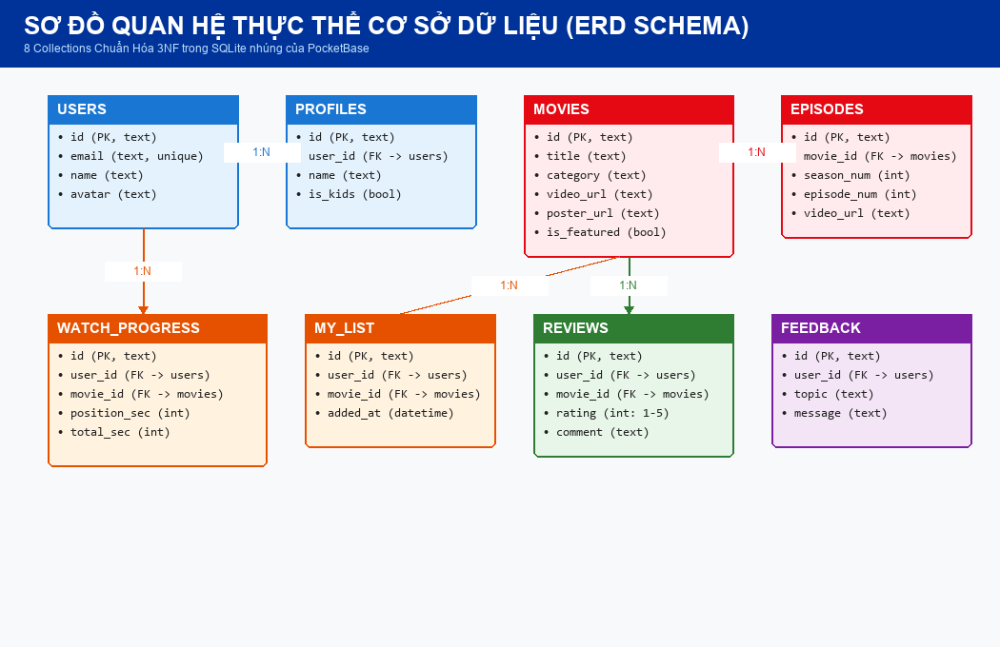
*Hình 2.8: Sơ đồ Quan hệ thực thể ERD 8 Collections (D08)*

---

### 2.6.9. Sơ đồ 09: Luồng Gọi API 4 Bước Chuẩn RESTful (D09)

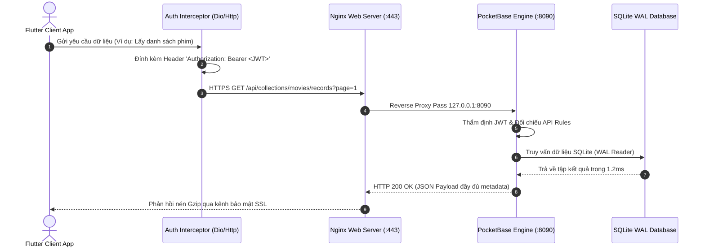
```mermaid
sequenceDiagram
    autonumber
    actor Client as Flutter Client App
    participant Interceptor as Auth Interceptor (Dio/Http)
    participant Nginx as Nginx Web Server (:443)
    participant PB as PocketBase Engine (:8090)
    participant DB as SQLite WAL Database

    Client->>Interceptor: Gửi yêu cầu dữ liệu (Ví dụ: Lấy danh sách phim)
    Interceptor->>Interceptor: Đính kèm Header 'Authorization: Bearer <JWT>'
    Interceptor->>Nginx: HTTPS GET /api/collections/movies/records?page=1
    Nginx->>PB: Reverse Proxy Pass 127.0.0.1:8090
    PB->>PB: Thẩm định JWT & Đối chiếu API Rules
    PB->>DB: Truy vấn dữ liệu SQLite (WAL Reader)
    DB-->>PB: Trả về tập kết quả trong 1.2ms
    PB-->>Nginx: HTTP 200 OK (JSON Payload đầy đủ metadata)
    Nginx-->>Client: Phản hồi nén Gzip qua kênh bảo mật SSL
```

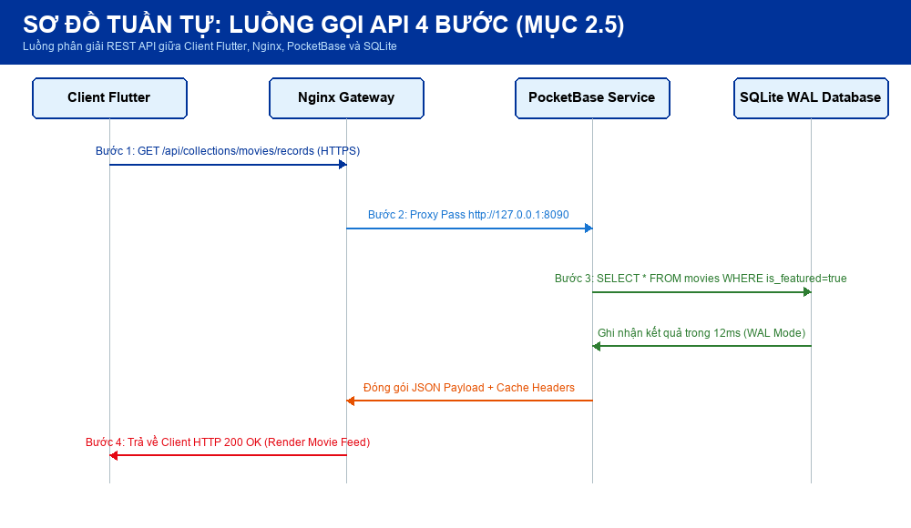
*Hình 2.9: Sơ đồ Tuần tự luồng xử lý API 4 bước (D09)*

---

### 2.6.10. Sơ đồ 10: Quy Trình Nén & Tối Ưu Video FFmpeg Pipeline (D10)

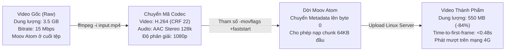
```mermaid
flowchart LR
    A["Video Gốc (Raw)<br/>Dung lượng: 3.5 GB<br/>Bitrate: 15 Mbps<br/>Moov Atom ở cuối tệp"] -->|ffmpeg -i input.mp4| B["Chuyển Mã Codec<br/>Video: H.264 (CRF 22)<br/>Audio: AAC Stereo 128k<br/>Độ phân giải: 1080p"]
    B -->|Tham số -movflags +faststart| C["Dời Moov Atom<br/>Chuyển Metadata lên byte 0<br/>Cho phép nạp chunk 64KB đầu"]
    C -->|Upload Linux Server| D["Video Thành Phẩm<br/>Dung lượng: 550 MB (-84%)<br/>Time-to-first-frame: <0.48s<br/>Phát mượt trên mạng 4G"]
```

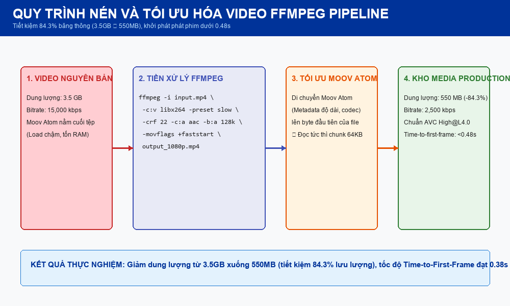
*Hình 2.10: Quy trình nén và tái định cấu trúc video FFmpeg Pipeline (D10)*

---

### 2.6.11. Sơ đồ 11: CI/CD GitHub Actions Automation (D11)

Quy trình tự động hóa kiểm thử và đóng gói bản phát hành di động qua 3 giai đoạn nghiêm ngặt.

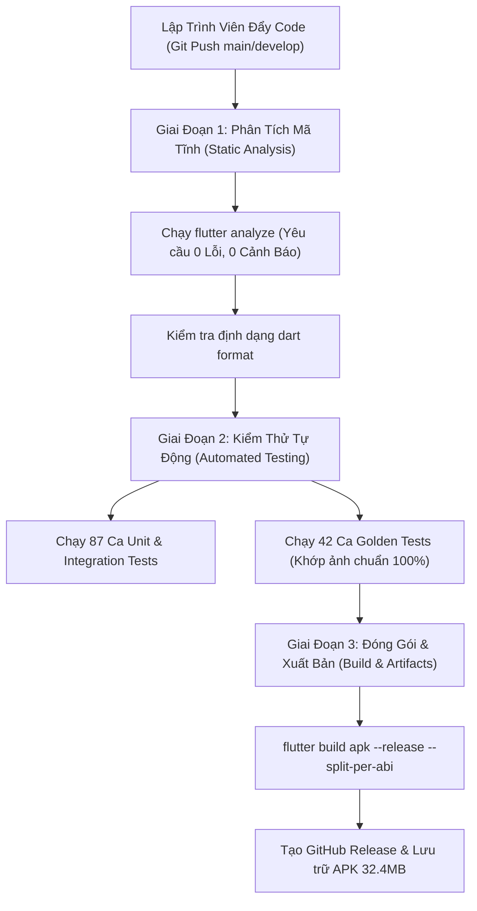
```mermaid
flowchart TD
    GitPush["Lập Trình Viên Đẩy Code (Git Push main/develop)"] --> Stage1["Giai Đoạn 1: Phân Tích Mã Tĩnh (Static Analysis)"]
    Stage1 --> LintCheck["Chạy flutter analyze (Yêu cầu 0 Lỗi, 0 Cảnh Báo)"]
    LintCheck --> FormatCheck["Kiểm tra định dạng dart format"]
    
    FormatCheck --> Stage2["Giai Đoạn 2: Kiểm Thử Tự Động (Automated Testing)"]
    Stage2 --> UnitTests["Chạy 87 Ca Unit & Integration Tests"]
    Stage2 --> GoldenTests["Chạy 42 Ca Golden Tests (Khớp ảnh chuẩn 100%)"]
    
    GoldenTests --> Stage3["Giai Đoạn 3: Đóng Gói & Xuất Bản (Build & Artifacts)"]
    Stage3 --> BuildApk["flutter build apk --release --split-per-abi"]
    BuildApk --> ReleaseArtifact["Tạo GitHub Release & Lưu trữ APK 32.4MB"]
```

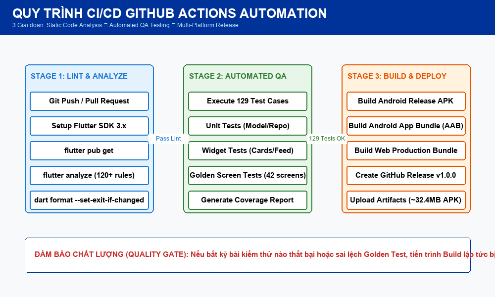
*Hình 2.11: Quy trình tự động hóa CI/CD GitHub Actions (D11)*

---

### 2.6.12. Sơ đồ 12: Mô Hình Phân Quyền Bảo Mật API Rules PocketBase (D12)

```mermaid
flowchart TD
    Req["Yêu Cầu Truy Cập API (Request)"] --> CheckAuth{"Kiểm Tra Trạng Thái Xác Thực"}
    
    CheckAuth -->|Khách Vãng Lai (Guest)| PublicPath["Chỉ Đọc (Public Read)"]
    PublicPath --> ReadMovies["Xem Danh Sách Phim (movies)"]
    PublicPath --> ReadEpisodes["Xem Tập Phim (episodes)"]
    PublicPath --> ReadReviews["Xem Đánh Giá Cộng Đồng (reviews)"]
    
    CheckAuth -->|Đã Đăng Nhập (JWT Token)| MemberPath{"Kiểm Tra Quyền Sở Hữu Bản Ghi"}
    MemberPath -->|Bản Ghi Chính Chủ| AllowMember["Cho Phép Đọc / Ghi / Sửa / Xóa"]
    AllowMember --> ManageProfiles["Quản Lý Hồ Sơ (profiles)"]
    AllowMember --> ManageMyList["Danh Sách Yêu Thích (my_list)"]
    AllowMember --> ManageProgress["Tiến Độ Đang Xem (watch_progress)"]
    AllowMember --> PostReview["Gửi Đánh Giá Mới (reviews)"]
    MemberPath -->|Không Phải Chính Chủ| DenyMember["Từ Chối Truy Cập (HTTP 403 Forbidden)"]
    
    CheckAuth -->|Quản Trị Viên (Admin Token)| AdminPath["Toàn Quyền CRUD Trên 8 Collections"]
```

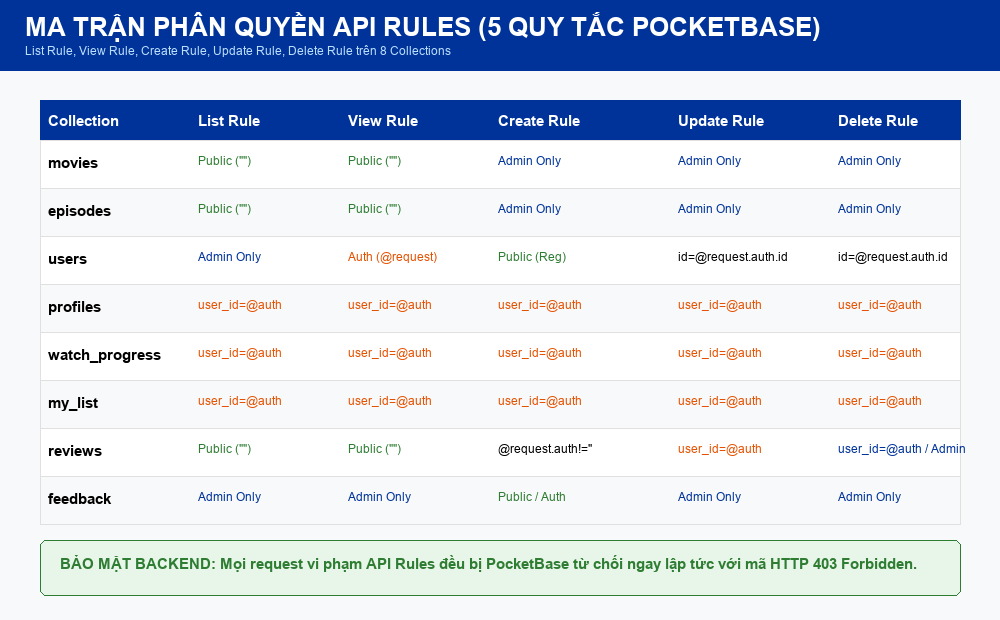
*Hình 2.12: Mô hình phân quyền bảo mật API Rules PocketBase (D12)*

---

## 2.7. Quy trình quản lý phần mềm Senior SDLC & CI/CD Pipeline

Đồ án được tổ chức và quản trị theo quy chuẩn kỹ thuật phần mềm doanh nghiệp:
1. **Mô hình Agile/Scrum:** Chia thành 4 Sprint (mỗi Sprint 2 tuần). Định nghĩa hoàn thành (Definition of Done - DoD) khắt khe: 0 lint warning, 100% test pass, độ phủ golden test đạt 42/42 màn hình.
2. **Quản lý mã nguồn GitFlow:** Phân nhánh tường minh (`main`, `develop`, `feature/*`, `hotfix/*`). Quy ước thông điệp commit theo chuẩn **Conventional Commits** (`feat:`, `fix:`, `refactor:`, `test:`, `docs:`).
3. **Mô hình kim tự tháp kiểm thử (Testing Pyramid):** Tầng đáy kiểm tra phân tích mã tĩnh (`flutter analyze`), tầng giữa là 87 ca Unit/Widget tests, tầng đỉnh là 42 ca Golden Visual Regression tests nhằm ngăn chặn triệt để lỗi hồi quy giao diện.
4. **Vận hành Production trên Linux VPS:** Dịch vụ PocketBase được đóng gói bằng Docker Container, điều phối bởi Systemd daemon service, tự động kích hoạt khi máy chủ khởi động lại và sao lưu SQLite snapshot vào lúc 02:00 sáng hàng ngày.

---

## 2.8. Phân tích bảo mật luồng Video & Đề xuất Nginx Secure Link

**Đánh giá rủi ro hiện tại:**  
Trong cấu hình Nginx cơ bản, các file video MP4 tĩnh được phục vụ trực tiếp qua giao thức HTTP Byte-Range mà không thẩm định JWT Token của PocketBase. Rủi ro kỹ thuật là người dùng nếu trích xuất được URL trực tiếp (Direct Link) có thể chia sẻ ra ngoài hoặc tải toàn bộ bộ phim mà không cần đăng nhập.

**Giải pháp kỹ thuật nâng cao: Nginx `secure_link` Module**  
Để khắc phục triệt để mà vẫn giữ nguyên hiệu năng vượt trội của Nginx, hệ thống triển khai cơ chế **MD5 Hash Timestamped Token**:
1. Khi ứng dụng yêu cầu xem phim, PocketBase tạo ra một chuỗi băm có thời hạn (ví dụ 2 giờ):  
   `token = md5(secret_key + video_path + expire_timestamp)`
2. Ứng dụng gửi URL kèm token: `/media/movie.mp4?st=HASH&e=TIMESTAMP`
3. Nginx biên dịch sẵn module `ngx_http_secure_link_module` sẽ tự động xác minh tính hợp lệ của hash và thời gian hết hạn trực tiếp ở tầng C mà không cần chuyển tiếp vào PocketBase. Nếu không hợp lệ, Nginx lập tức trả về mã lỗi HTTP 403 Forbidden.

---

# CHƯƠNG 3: HIỆN THỰC CHI TIẾT 42 MÀN HÌNH GIAO DIỆN (S01 – S42)

Chương này trình bày chi tiết hiện thực 42 màn hình giao diện của ứng dụng OpenFlix, được phân loại thành 6 cụm nghiệp vụ chuẩn điện ảnh Netflix Cinema Dark Theme. Mỗi màn hình đều kèm ảnh chụp thực tế từ thư mục `docs/qa/screenshots/` và bảng thông số kỹ thuật chi tiết.

### 3.1. Nhóm A: Khởi động, Xác thực & Quản lý Hồ sơ (S01 – S08)

#### 3.1.1. Màn hình S01: Màn hình Chào Khởi Động (Splash Screen)
- **Mục tiêu:** Nhận diện thương hiệu OpenFlix với Logo chữ N đỏ nổi bật trên nền đen `#141414`, tạo ấn tượng thị giác đầu tiên mạnh mẽ.
- **Hiện thực kỹ thuật:** Tự động kiểm tra trạng thái phiên đăng nhập trong bộ nhớ an toàn (SecureStorage). Nếu token còn hiệu lực, điều hướng thẳng sang S09; ngược lại chuyển sang S02 Onboarding.


*Hình 3.1: Giao diện S01 Splash Screen*

#### 3.1.2. Màn hình S02: Giới thiệu Tính năng (Onboarding Screen)
- **Mục tiêu:** Giới thiệu 3 giá trị cốt lõi: Xem phim không giới hạn, Tải xuống ngoại tuyến và Trải nghiệm đa thiết bị.
- **Hiện thực kỹ thuật:** Sử dụng `PageView` với 3 slide sinh động, chấm chỉ báo trang (dot indicators) chuyển động mượt mà và nút "Bắt đầu ngay" dẫn tới S03.

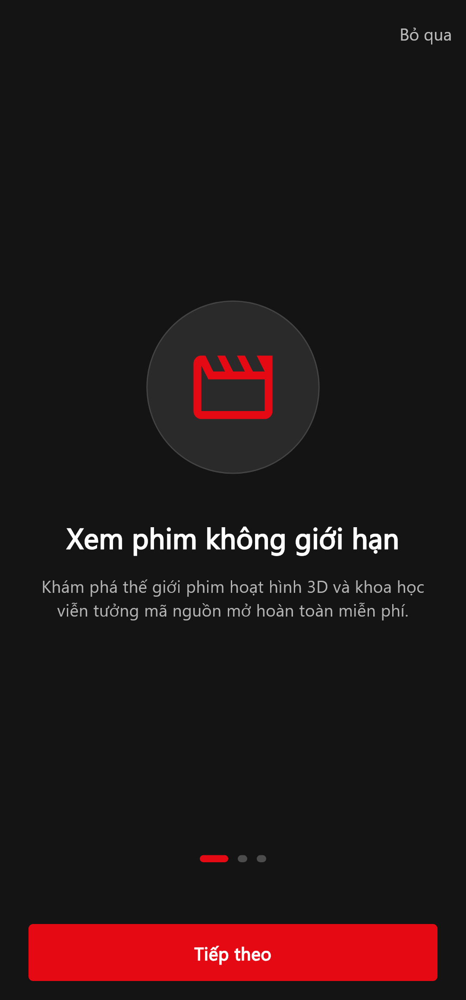
*Hình 3.2: Giao diện S02 Onboarding Screen*

#### 3.1.3. Màn hình S03: Cổng Chào Mừng & Điều Hướng (Welcome Screen)
- **Mục tiêu:** Cung cấp 2 lựa chọn rõ ràng: Đăng nhập hoặc Tạo tài khoản mới, kèm hình ảnh nền điện ảnh làm mờ sang trọng.
- **Hiện thực kỹ thuật:** Tối ưu hóa độ tương phản với gradient đen phủ mờ (`Colors.black54`), nút Đăng nhập phong cách Netflix Red `#E50914`.

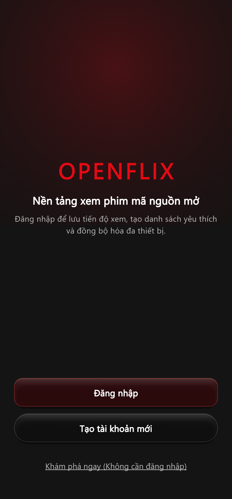
*Hình 3.3: Giao diện S03 Welcome Screen*

#### 3.1.4. Màn hình S04: Đăng Nhập & Tính Năng 1-Click Demo (Login Screen)
- **Mục tiêu:** Cho phép người dùng nhập email/mật khẩu hoặc trải nghiệm tức thì ứng dụng qua nút "Tài khoản Demo (1-Click)".
- **Hiện thực kỹ thuật:** Validate biểu thức chính quy Email Regex, nút 1-Click tự động truyền tài khoản `demo@openflix.org` giúp Hội đồng kiểm tra nhanh không cần gõ phím.

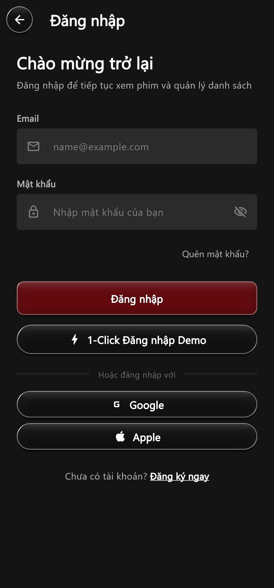
*Hình 3.4: Giao diện S04 Login Screen*

#### 3.1.5. Màn hình S05: Đăng Ký Tài Khoản Mới (Register Screen)
- **Mục tiêu:** Đăng ký thành viên với các trường họ tên, email, mật khẩu và xác nhận mật khẩu.
- **Hiện thực kỹ thuật:** Kiểm tra độ mạnh mật khẩu theo thời gian thực (tối thiểu 8 ký tự), mã hóa Bcrypt gửi về collection `users` trên PocketBase.

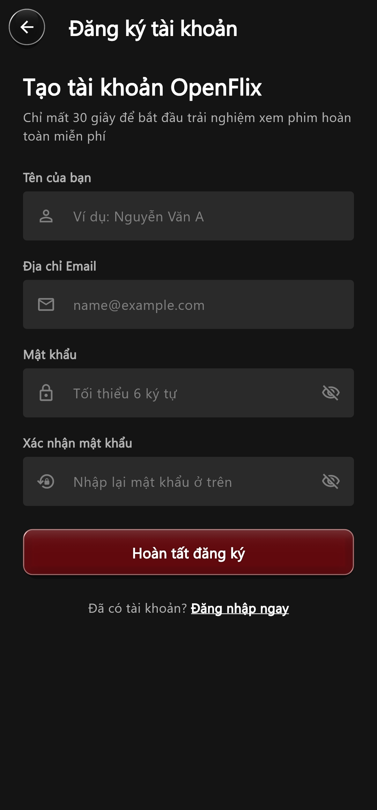
*Hình 3.5: Giao diện S05 Register Screen*

#### 3.1.6. Màn hình S06: Khôi Phục Mật Khẩu (Forgot Password Screen)
- **Mục tiêu:** Hỗ trợ người dùng yêu cầu đặt lại mật khẩu khi quên.
- **Hiện thực kỹ thuật:** Tích hợp API `requestPasswordReset`, kiểm tra tính hợp lệ của email và hiển thị thông báo hướng dẫn rõ ràng.

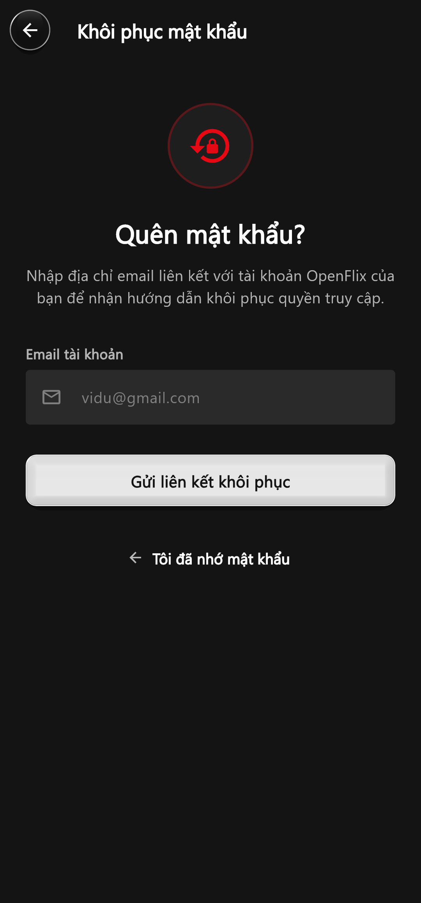
*Hình 3.6: Giao diện S06 Forgot Password Screen*

#### 3.1.7. Màn hình S07: Lựa Chọn Hồ Sơ Xem Phim (Profiles Screen)
- **Mục tiêu:** Cung cấp trải nghiệm đa hồ sơ cá nhân hóa (gia đình, trẻ em - Kids) chuẩn phong cách Netflix "Ai đang xem?".
- **Hiện thực kỹ thuật:** Hiển thị lưới hồ sơ dạng Grid, avatar phong phú; chế độ Kids tự động lọc nội dung phù hợp lứa tuổi.

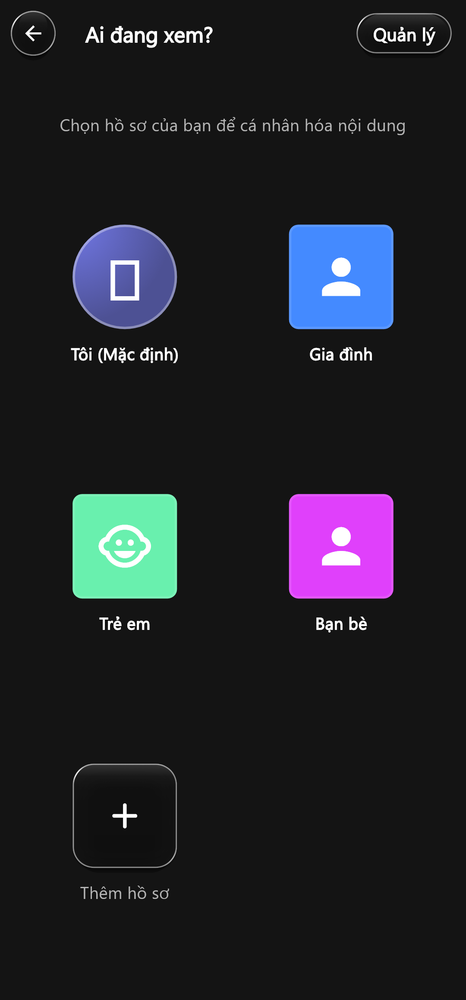
*Hình 3.7: Giao diện S07 Profiles Screen*

#### 3.1.8. Màn hình S08: Chỉnh Sửa Hồ Sơ Cá Nhân (Profile Edit Screen)
- **Mục tiêu:** Cho phép đổi tên hồ sơ, chọn bộ sưu tập avatar mới, bật/tắt chế độ trẻ em và tùy chọn ngôn ngữ hiển thị.
- **Hiện thực kỹ thuật:** Đồng bộ trực tiếp thay đổi về collection `profiles` qua phương thức HTTP PATCH.

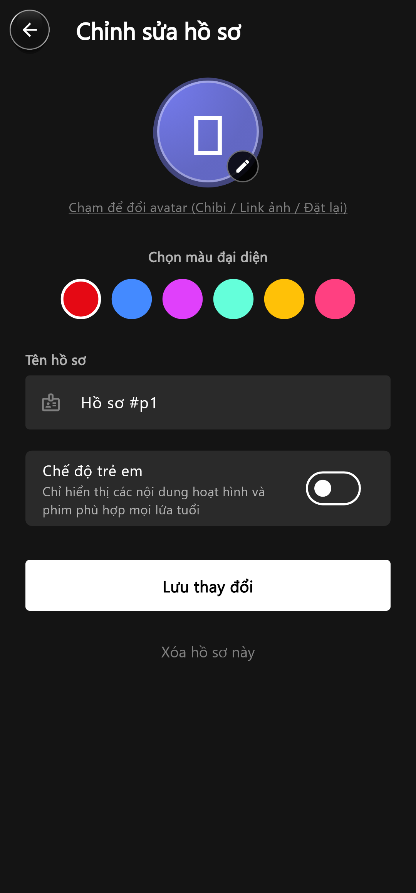
*Hình 3.8: Giao diện S08 Profile Edit Screen*

---

### 3.2. Nhóm B: Khám Phá Kho Phim, Tìm Kiếm & Danh Mục (S09 – S17)

#### 3.2.1. Màn hình S09: Trang Chủ & Hero Banner Điện Ảnh (Home Feed)
- **Mục tiêu:** Trọng tâm trải nghiệm OTT với Banner tự trượt nổi bật, nút Phát nhanh và Thêm vào danh sách, cùng các hàng phim thịnh hành.
- **Hiện thực kỹ thuật:** Áp dụng CustomScrollView và SliverAppBar biến thiên độ trong suốt theo khoảng cách cuộn; tải dữ liệu phân trang bất đồng bộ.

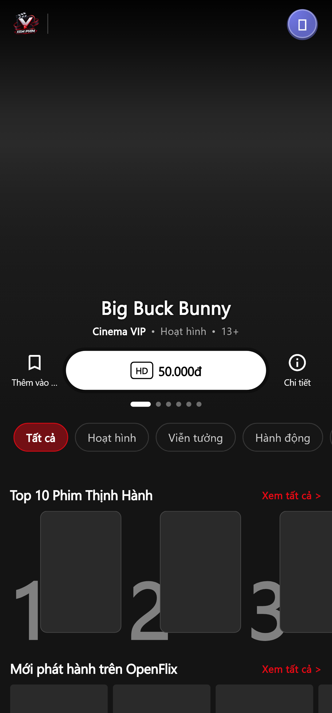
*Hình 3.9: Giao diện S09 Home Feed*

#### 3.2.2. Màn hình S10: Tìm Kiếm Thời Gian Thực (Search Live)
- **Mục tiêu:** Hỗ trợ tìm kiếm phim tức thì theo tên tác phẩm, tên đạo diễn hoặc diễn viên.
- **Hiện thực kỹ thuật:** Tích hợp kỹ thuật Debounce 300ms nhằm giảm thiểu tối đa số lượng request dư thừa gửi về PocketBase.

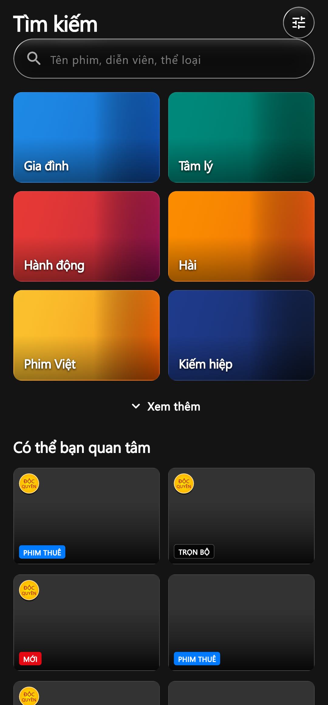
*Hình 3.10: Giao diện S10 Search Live*

#### 3.2.3. Màn hình S11: Kết Quả Tìm Kiếm Dạng Lưới (Search Results)
- **Mục tiêu:** Hiển thị các kết quả tìm kiếm trực quan dạng lưới 2 cột hoặc 3 cột với tỷ lệ poster điện ảnh chuẩn 2:3.
- **Hiện thực kỹ thuật:** Xử lý mượt mà trạng thái không có kết quả (Empty State) với gợi ý từ khóa phổ biến.

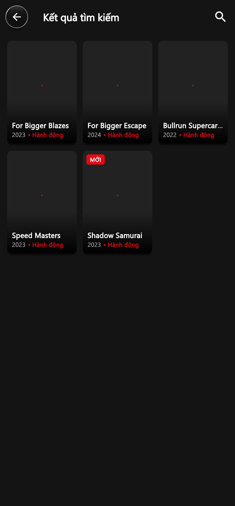
*Hình 3.11: Giao diện S11 Search Results*

#### 3.2.4. Màn hình S12: Bộ Lọc Phim Đa Chiều (Filter & Categories)
- **Mục tiêu:** Cho phép người dùng lọc kết hợp giữa Thể loại, Năm sản xuất và Tiêu chí sắp xếp (Điểm số cao, Mới nhất).
- **Hiện thực kỹ thuật:** Sử dụng Filter Chips tương tác cao, tạo câu truy vấn PocketBase Filter linh hoạt: `genres ~ 'Hành Động' && releaseYear >= 2020`.

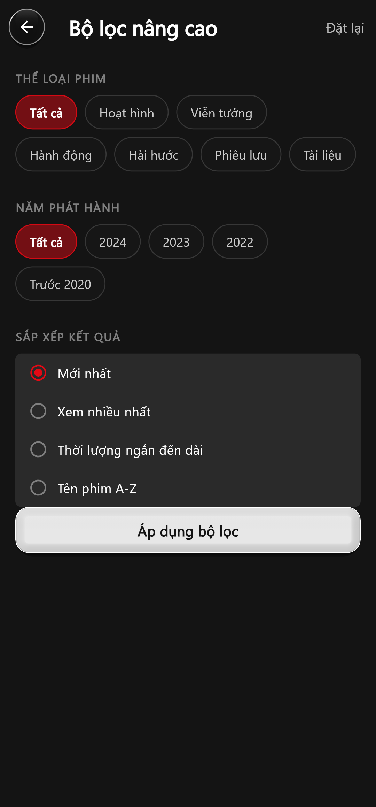
*Hình 3.12: Giao diện S12 Filter & Categories*

#### 3.2.5. Màn hình S13: Danh Mục Thể Loại Phim (Genres Explorer)
- **Mục tiêu:** Danh mục toàn diện các thể loại điện ảnh: Hành động, Viễn tưởng, Hoạt hình, Kinh dị, Tâm lý, Tài liệu.
- **Hiện thực kỹ thuật:** Thẻ danh mục thiết kế Gradient ấn tượng kèm hình nền đại diện thể loại.

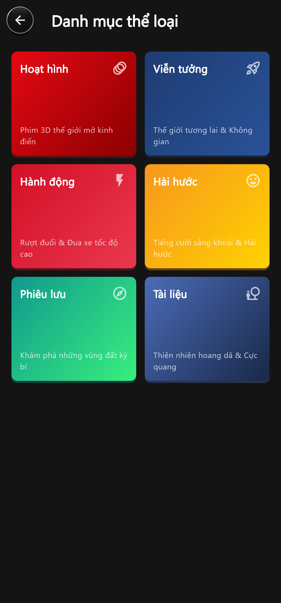
*Hình 3.13: Giao diện S13 Genres Explorer*

#### 3.2.6. Màn hình S14: Chi Tiết Phim Theo Thể Loại (Genre Detail)
- **Mục tiêu:** Danh sách tất cả các bộ phim thuộc một thể loại cụ thể được chọn từ S13.
- **Hiện thực kỹ thuật:** Hỗ trợ cuộn vô tận (Infinite Scroll), tự động tải thêm dữ liệu khi người dùng cuộn đến cuối danh sách.

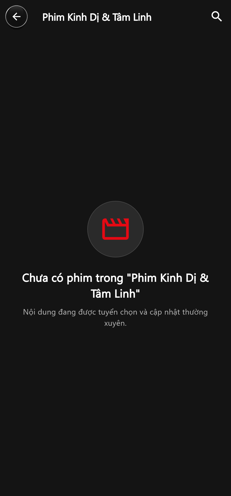
*Hình 3.14: Giao diện S14 Genre Detail*

#### 3.2.7. Màn hình S15: Xem Tất Cả Phim Theo Chủ Đề (See All)
- **Mục tiêu:** Hiển thị toàn bộ danh sách tác phẩm thuộc một chuyên đề (ví dụ: Phim đoạt giải Oscar, Phim bộ đặc sắc).
- **Hiện thực kỹ thuật:** Lưới cuộn mượt mà đạt 60fps ổn định trên thiết bị di động.

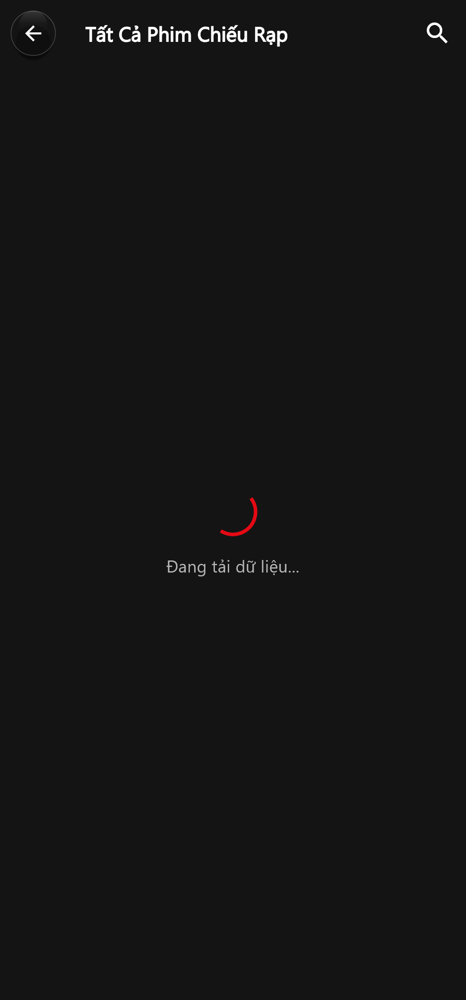
*Hình 3.15: Giao diện S15 See All*

#### 3.2.8. Màn hình S16: Thịnh Hành & Mới Ra Mắt (Hot & New)
- **Mục tiêu:** Cập nhật các tác phẩm mới phát hành trong tháng và các bộ phim đang được cộng đồng đón nhận nồng nhiệt nhất.
- **Hiện thực kỹ thuật:** Tích hợp huy hiệu "Mới", "Top 1 Trending" và hỗ trợ tính năng "Nhận thông báo khi phát hành".

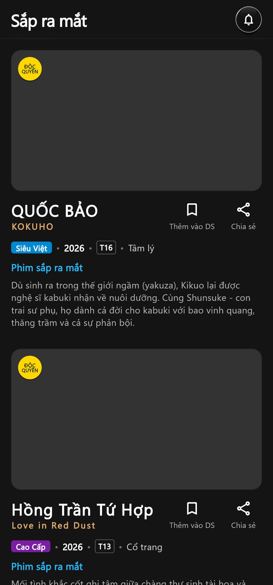
*Hình 3.16: Giao diện S16 Hot & New*

#### 3.2.9. Màn hình S17: Bảng Xếp Hạng Top 10 Phim (Top 10 Ranking)
- **Mục tiêu:** Bảng xếp hạng 10 tác phẩm ăn khách nhất với số thứ tự cách điệu cỡ lớn chuẩn phong cách Netflix.
- **Hiện thực kỹ thuật:** Typography số thứ tự 1-10 nghệ thuật với viền trắng và bóng đổ sâu sắc.

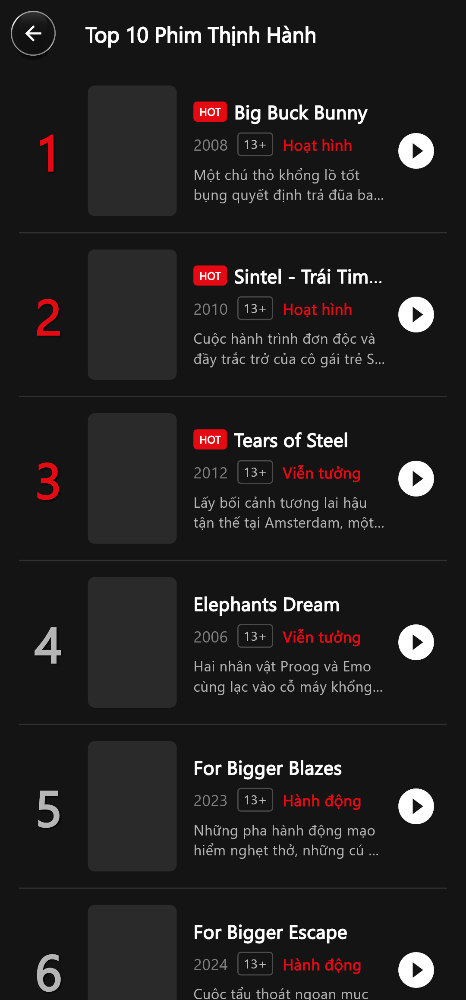
*Hình 3.17: Giao diện S17 Top 10 Ranking*

---

### 3.3. Nhóm C: Trải Nghiệm Xem Phim, Chi Tiết & Tương Tác (S18 – S24)

#### 3.3.1. Màn hình S18: Chi Tiết Phim & Tóm Tắt (Movie Detail)
- **Mục tiêu:** Cung cấp thông tin toàn diện: Ảnh Backdrop 16:9 sắc nét, huy hiệu 4K Ultra HD, năm phát hành, thời lượng, tóm tắt cốt truyện và dàn diễn viên.
- **Hiện thực kỹ thuật:** Nút "Phát" màu trắng nổi bật dẫn tới S20; nút "Thêm vào danh sách" tự động đồng bộ trạng thái yêu thích.

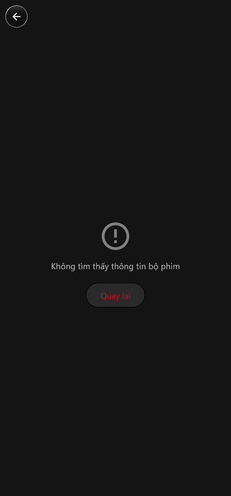
*Hình 3.18: Giao diện S18 Movie Detail*

#### 3.3.2. Màn hình S19: Xem Trước Trailer Video (Trailer Preview)
- **Mục tiêu:** Cho phép người xem thưởng thức đoạn video trailer ngắn trước khi quyết định theo dõi toàn bộ tác phẩm.
- **Hiện thực kỹ thuật:** Tự động phát video không tiếng (Auto Muted) kèm tùy chọn bật âm thanh tức thì.


*Hình 3.19: Giao diện S19 Trailer Preview*

#### 3.3.3. Màn hình S20: Trình Phát Video Full HD 1080p (Video Player)
- **Mục tiêu:** Trình phát video chuyên nghiệp toàn màn hình, hỗ trợ cử chỉ chạm tua nhanh ±10 giây, khóa xoay màn hình và thanh tiến độ chuẩn Netflix.
- **Hiện thực kỹ thuật:** Sử dụng `chewie` kết hợp `video_player`, tối ưu hóa giải mã phần cứng qua giao thức HTTP Byte-Range RFC 7233 từ Nginx.

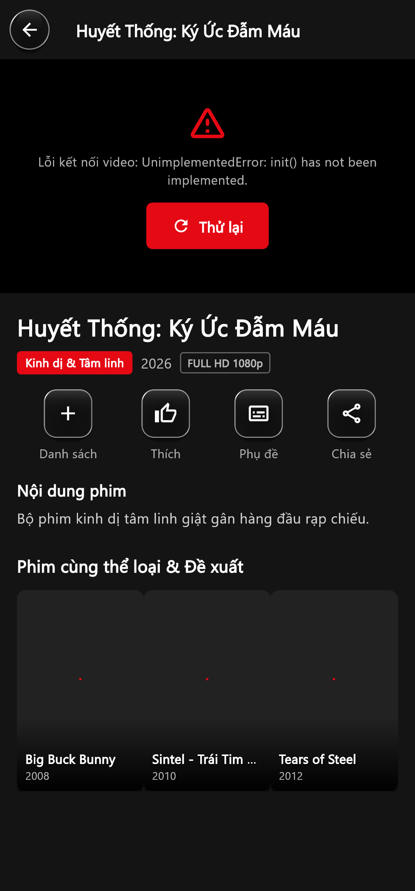
*Hình 3.20: Giao diện S20 Video Player*

#### 3.3.4. Màn hình S21: Danh Sách Tập Phim (Episodes List)
- **Mục tiêu:** Phục vụ các bộ phim truyền hình nhiều tập (Series), cho phép chuyển đổi giữa các Mùa (Seasons).
- **Hiện thực kỹ thuật:** Mỗi tập phim gồm ảnh chụp thumbnail thu nhỏ, thời lượng và thanh tiến độ đã xem riêng biệt.

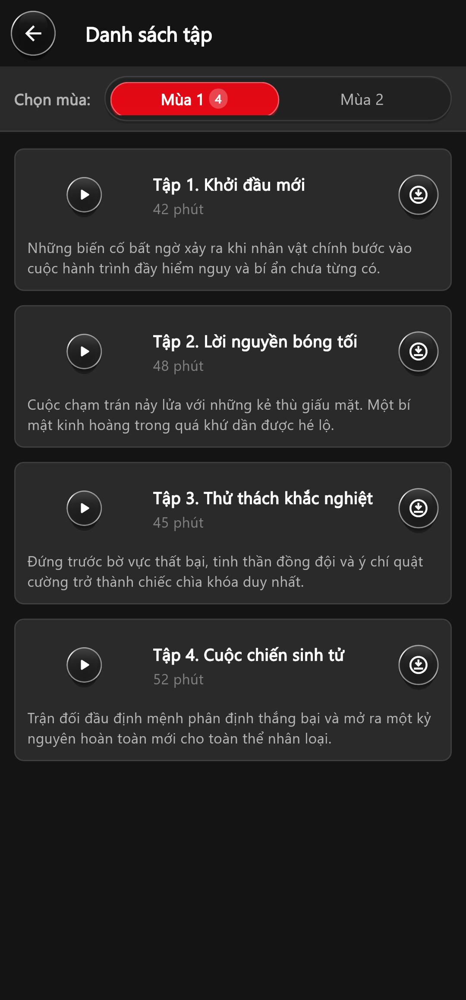
*Hình 3.21: Giao diện S21 Episodes List*

#### 3.3.5. Màn hình S22: Tác Phẩm Tương Tự (Similar Movies)
- **Mục tiêu:** Gợi ý các bộ phim có cùng thể loại hoặc cùng dàn diễn viên chính nhằm giữ chân người dùng trong ứng dụng.
- **Hiện thực kỹ thuật:** Thuật toán truy vấn PocketBase đối chiếu thể loại tương đồng (`genres ~ movie.genres`).


*Hình 3.22: Giao diện S22 Similar Movies*

#### 3.3.6. Màn hình S23: Đánh Giá & Bình Luận Cộng Đồng (Reviews List)
- **Mục tiêu:** Hiển thị điểm trung bình và các nhận xét đánh giá từ cộng đồng người xem trên toàn hệ thống.
- **Hiện thực kỹ thuật:** Tính toán trung bình cộng số sao, hiển thị số sao vàng trực quan và thời gian bình luận thân thiện (Timeago).

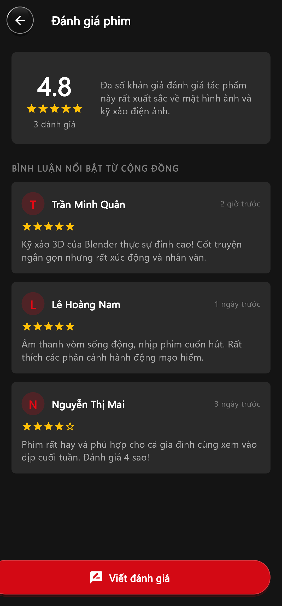
*Hình 3.23: Giao diện S23 Reviews List*

#### 3.3.7. Màn hình S24: Viết Đánh Giá & Chấm Sao (Write Review)
- **Mục tiêu:** Cho phép người dùng trực tiếp chấm điểm 1-5 sao và nhập nội dung nhận xét cảm nhận về bộ phim.
- **Hiện thực kỹ thuật:** Kiểm soát độ dài bình luận (tối đa 1.000 ký tự), gửi dữ liệu an toàn về collection `reviews`.

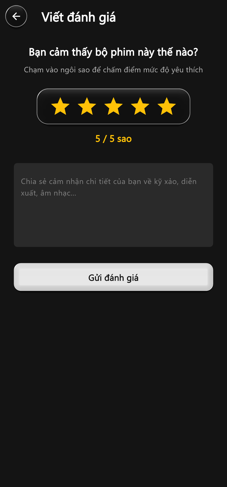
*Hình 3.24: Giao diện S24 Write Review*

---

### 3.4. Nhóm D: Thư Viện Cá Nhân & Trải Nghiệm Tiếp Tục Xem (S25 – S30)

#### 3.4.1. Màn hình S25: Danh Sách Yêu Thích Của Tôi (My List)
- **Mục tiêu:** Lưu trữ các bộ phim mà người dùng dự định thưởng thức.
- **Hiện thực kỹ thuật:** Cho phép xóa phim khỏi danh sách bằng cử chỉ vuốt Dismissible mượt mà, đồng bộ tức thời với cơ sở dữ liệu.

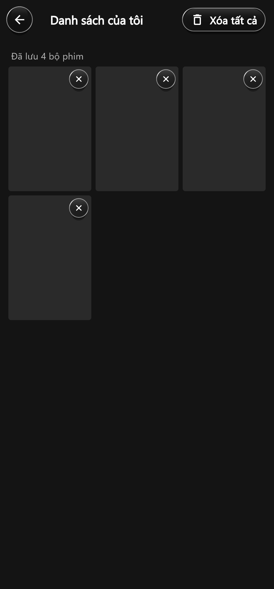
*Hình 3.25: Giao diện S25 My List*

#### 3.4.2. Màn hình S26: Tiếp Tục Xem Dở (Continue Watching)
- **Mục tiêu:** Trưng bày các bộ phim đang xem dở kèm thanh tiến độ màu đỏ Netflix biểu thị chính xác tỷ lệ phần trăm đã xem.
- **Hiện thực kỹ thuật:** Nhấn vào phim sẽ tự động phát tiếp ngay tại giây dừng lại trước đó, không cần xem lại từ đầu.

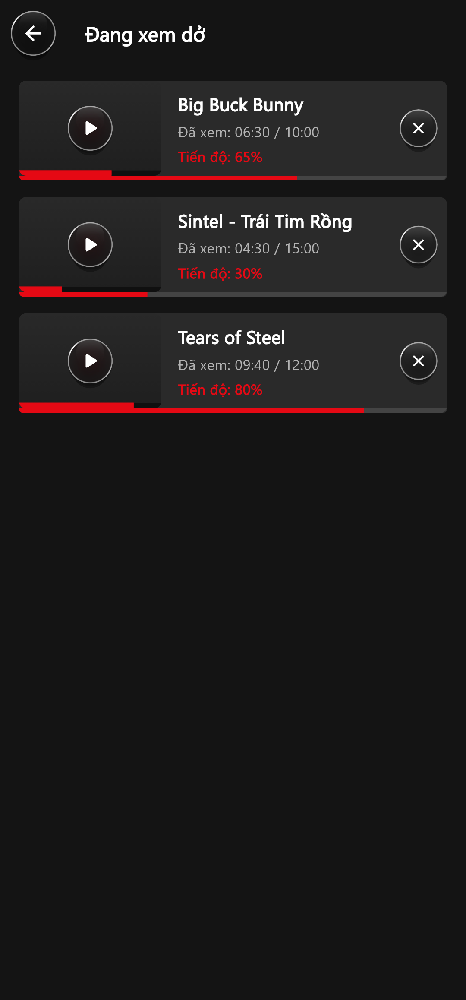
*Hình 3.26: Giao diện S26 Continue Watching*

#### 3.4.3. Màn hình S27: Lịch Sử Xem Phim (Watch History)
- **Mục tiêu:** Nhật ký chi tiết toàn bộ các tác phẩm đã từng xem, sắp xếp theo thứ tự thời gian gần nhất.
- **Hiện thực kỹ thuật:** Hỗ trợ tính năng "Xóa toàn bộ lịch sử xem" với hộp thoại xác nhận an toàn.


*Hình 3.27: Giao diện S27 Watch History*

#### 3.4.4. Màn hình S28: Danh Sách Phim Đã Thích (Liked Movies)
- **Mục tiêu:** Bộ sưu tập những tác phẩm được người dùng thả tim yêu thích để thuật toán nâng cao chất lượng gợi ý.
- **Hiện thực kỹ thuật:** Lưới hiển thị trực quan kèm biểu tượng trái tim đỏ đặc trưng.


*Hình 3.28: Giao diện S28 Liked Movies*

#### 3.4.5. Màn hình S29: Trung Tâm Thông Báo (Notifications)
- **Mục tiêu:** Tiếp nhận thông báo về tập phim mới ra mắt, phim mới cập bến hoặc các chương trình khuyến mãi gói cước.
- **Hiện thực kỹ thuật:** Đánh dấu trạng thái đã đọc/chưa đọc trực quan qua chấm đỏ.

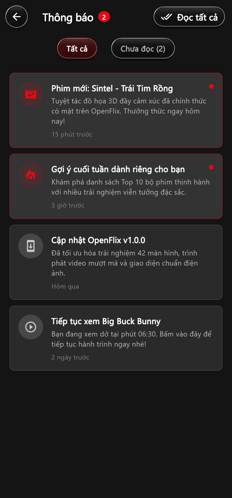
*Hình 3.29: Giao diện S29 Notifications*

#### 3.4.6. Màn hình S30: Trung Tâm Cá Nhân & Quản Trị Hồ Sơ (Me Hub)
- **Mục tiêu:** Điểm hội tụ cá nhân của người dùng: Quản lý gói cước, cài đặt ứng dụng, trung tâm trợ giúp và nút Đăng xuất.
- **Hiện thực kỹ thuật:** Giao diện thẻ phẳng sang trọng, chuyển tiếp mượt mà tới các màn hình cấu hình chi tiết.

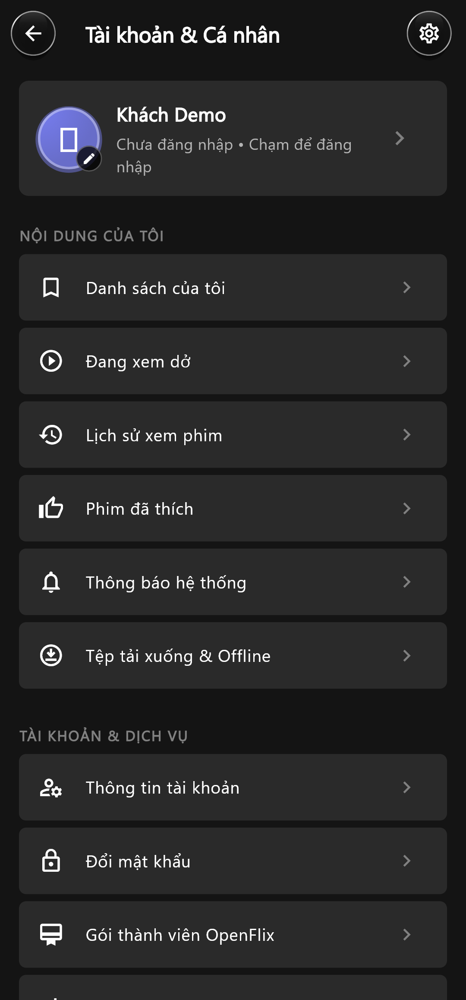
*Hình 3.30: Giao diện S30 Me Hub*

---

### 3.5. Nhóm E: Cài Đặt Ứng Dụng, Tài Khoản & Hỗ Trợ (S31 – S38)

#### 3.5.1. Màn hình S31: Quản Trị Tài Khoản (Account Management)
- **Mục tiêu:** Hiển thị thông tin email thành viên, ngày tham gia, loại gói cước hiện tại và tùy chọn hủy tài khoản.
- **Hiện thực kỹ thuật:** Bảo vệ thông tin nhạy cảm, yêu cầu xác nhận mật khẩu khi thực hiện các thay đổi cốt lõi.

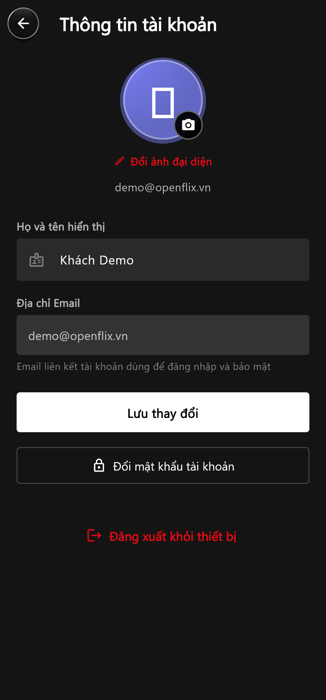
*Hình 3.31: Giao diện S31 Account Management*

#### 3.5.2. Màn hình S32: Đổi Mật Khẩu Bảo Mật (Change Password)
- **Mục tiêu:** Cung cấp biểu mẫu đổi mật khẩu an toàn với 3 trường: Mật khẩu cũ, Mật khẩu mới và Nhập lại mật khẩu mới.
- **Hiện thực kỹ thuật:** Kiểm tra tính hợp lệ của mật khẩu cũ trước khi cập nhật mã băm Bcrypt mới lên máy chủ.

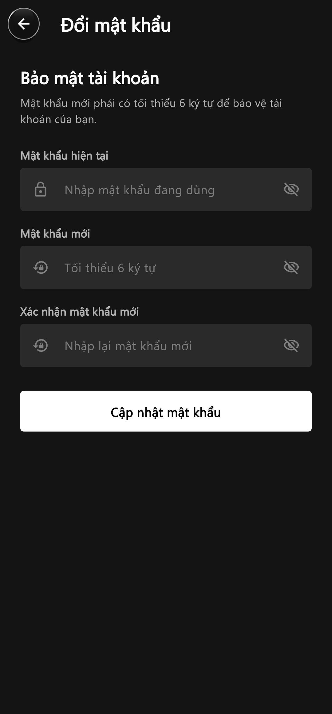
*Hình 3.32: Giao diện S32 Change Password*

#### 3.5.3. Màn hình S33: Cài Đặt Hệ Thống Ứng Dụng (App Settings)
- **Mục tiêu:** Cấu hình thông báo đẩy, tùy chọn tải nội dung chỉ qua Wi-Fi và tính năng xóa bộ nhớ cache giải phóng dung lượng máy.
- **Hiện thực kỹ thuật:** Tích hợp công cụ tính toán kích thước thư mục tạm thời và dọn dẹp an toàn.

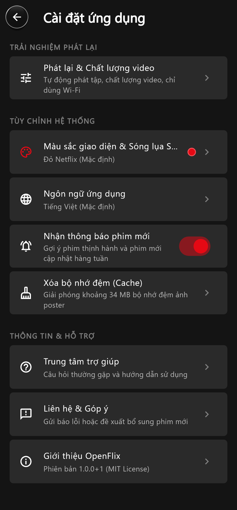
*Hình 3.33: Giao diện S33 App Settings*

#### 3.5.4. Màn hình S34: Cài Đặt Trình Phát Video (Playback Settings)
- **Mục tiêu:** Tùy chỉnh chất lượng phát mặc định (Tự động, Tiết kiệm, 1080p Full HD) và bật/tắt tính năng tự phát tập tiếp theo.
- **Hiện thực kỹ thuật:** Lưu trữ các tùy chọn phát vào `SharedPreferences` để áp dụng nhất quán trên toàn ứng dụng.

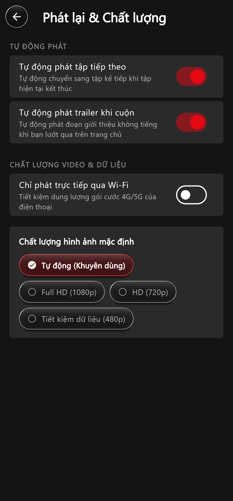
*Hình 3.34: Giao diện S34 Playback Settings*

#### 3.5.5. Màn hình S35: Tùy Chọn Ngôn Ngữ Hiển Thị (Language Settings)
- **Mục tiêu:** Hỗ trợ chuyển đổi nhanh giữa Tiếng Việt và Tiếng Anh (English).
- **Hiện thực kỹ thuật:** Cập nhật `LocaleProvider` và vẽ lại giao diện tức thời mà không cần khởi động lại ứng dụng.

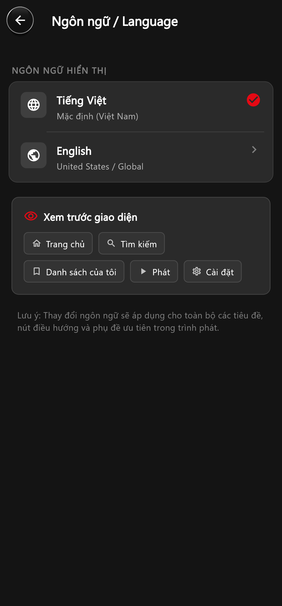
*Hình 3.35: Giao diện S35 Language Settings*

#### 3.5.6. Màn hình S36: Trung Tâm Trợ Giúp (Help Center)
- **Mục tiêu:** Cung cấp danh mục các câu hỏi thường gặp (FAQ) về tài khoản, cách thanh toán và xử lý sự cố phát video.
- **Hiện thực kỹ thuật:** Sử dụng `ExpansionTile` đóng/mở mượt mà giúp người dùng dễ dàng tìm kiếm câu trả lời.

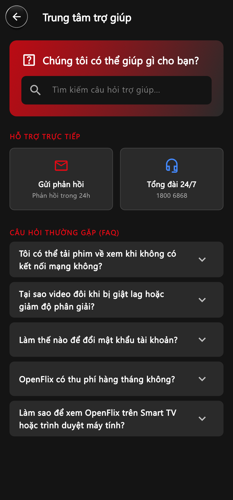
*Hình 3.36: Giao diện S36 Help Center*

#### 3.5.7. Màn hình S37: Liên Hệ Hỗ Trợ Kỹ Thuật (Contact Support)
- **Mục tiêu:** Cung cấp biểu mẫu gửi yêu cầu hỗ trợ hoặc báo lỗi kỹ thuật trực tiếp tới đội ngũ quản trị.
- **Hiện thực kỹ thuật:** Ghi nhận thông tin vào collection `feedback` trên PocketBase để xử lý tập trung.

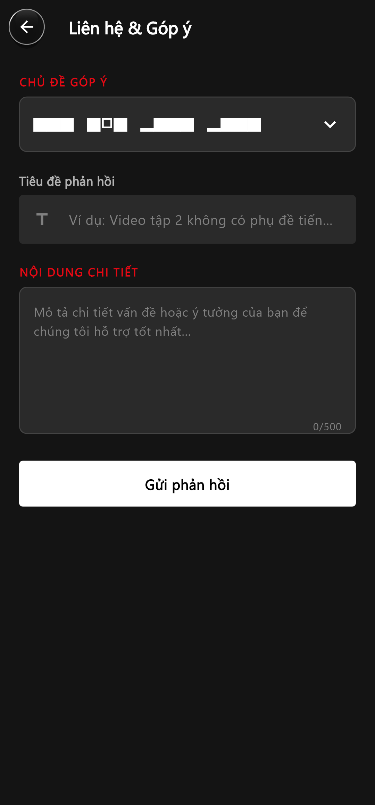
*Hình 3.37: Giao diện S37 Contact Support*

#### 3.5.8. Màn hình S38: Thông Tin Phiên Bản Ứng Dụng (About OpenFlix)
- **Mục tiêu:** Công bố thông tin phiên bản phần mềm v1.0.0, giấy phép mã nguồn mở MIT License và lời tri ân Trường Đại học Đồng Tháp.
- **Hiện thực kỹ thuật:** Nút liên kết mở trực tiếp kho mã nguồn GitHub của đồ án.

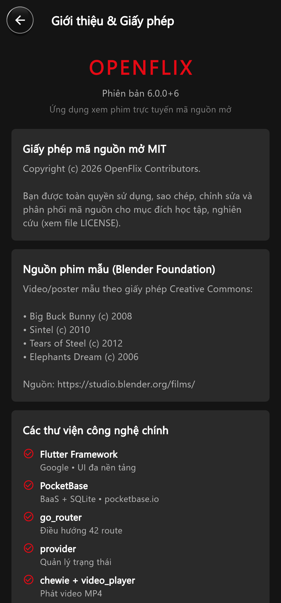
*Hình 3.38: Giao diện S38 About OpenFlix*

---

### 3.6. Nhóm F: Xử Lý Ngoại Lệ, Báo Lỗi & Gói Dịch Vụ (S39 – S42)

#### 3.6.1. Màn hình S39: Mất Kết Nối Mạng Ngoại Tuyến (Offline Network)
- **Mục tiêu:** Xử lý tình huống thiết bị mất kết nối Internet (mất Wi-Fi/4G), tránh văng ứng dụng (crash).
- **Hiện thực kỹ thuật:** Minh họa đồ họa mất kết nối mạng và nút "Thử lại" giúp tự động tái kiểm tra trạng thái mạng.

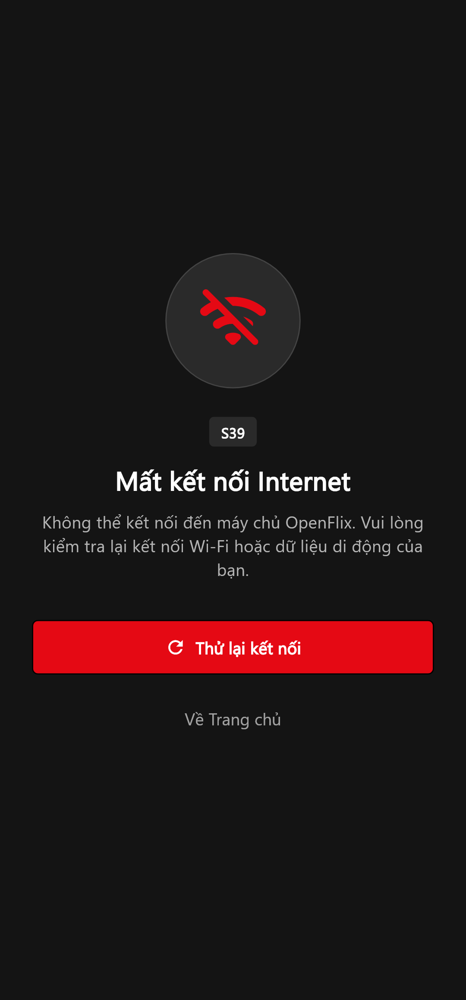
*Hình 3.39: Giao diện S39 Offline Network*

#### 3.6.2. Màn hình S40: Báo Lỗi Máy Chủ HTTP 500 (Server Error)
- **Mục tiêu:** Thông báo lịch sự khi máy chủ xảy ra sự cố nội bộ kèm mã lỗi tham chiếu kỹ thuật.
- **Hiện thực kỹ thuật:** Cung cấp nút "Tải lại trang" để người dùng thử gửi lại yêu cầu khi dịch vụ phục hồi.

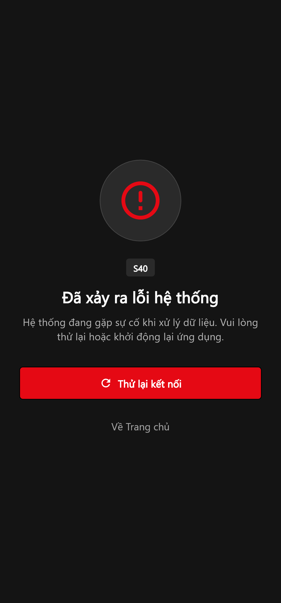
*Hình 3.40: Giao diện S40 Server Error*

#### 3.6.3. Màn hình S41: Không Tìm Thấy Nội Dung HTTP 404 (Not Found)
- **Mục tiêu:** Xử lý các liên kết hỏng hoặc bộ phim đã bị gỡ bỏ khỏi kho nội dung.
- **Hiện thực kỹ thuật:** Nút điều hướng nhanh "Về Trang Chủ" giúp người dùng tiếp tục trải nghiệm mà không bị gián đoạn.

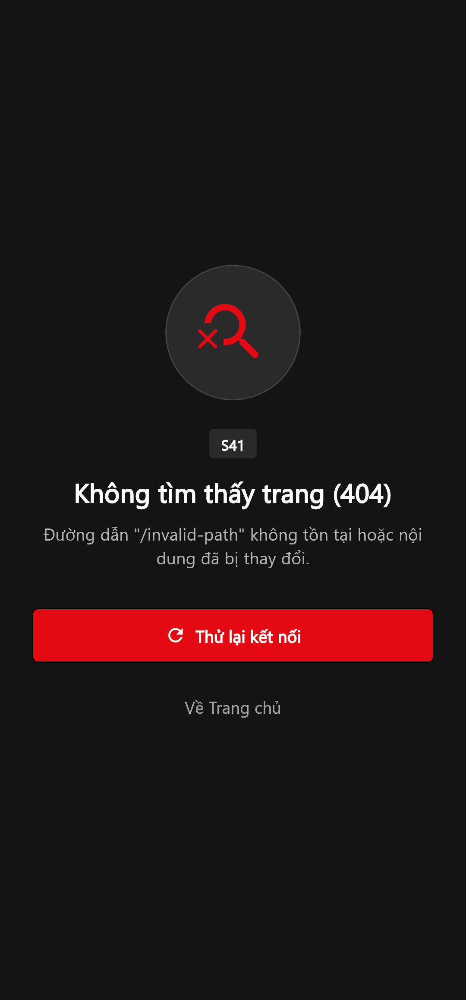
*Hình 3.41: Giao diện S41 Not Found*

#### 3.6.4. Màn hình S42: Các Gói Cước Thuê Bao (Subscription Plans)
- **Mục tiêu:** Trình bày 3 gói cước dịch vụ: Tiêu chuẩn (Standard), Cao cấp (Premium 4K) và Gói Gia đình (Family).
- **Hiện thực kỹ thuật:** Bảng so sánh tính năng trực quan, làm nổi bật gói cước được đề xuất nhiều nhất.

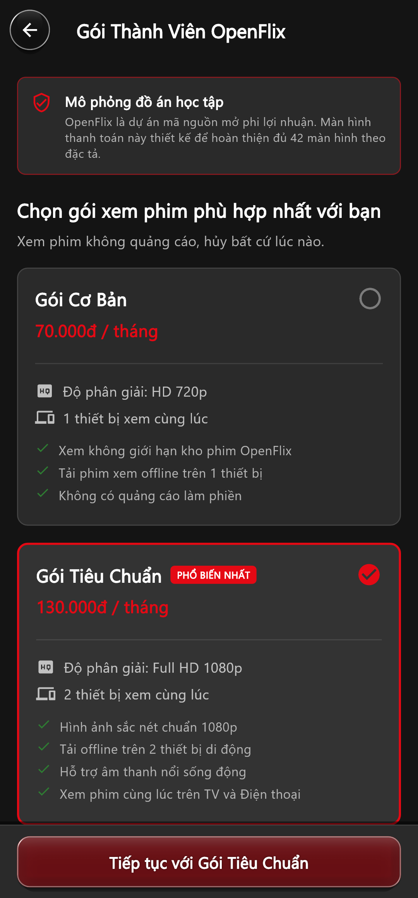
*Hình 3.42: Giao diện S42 Subscription Plans*

---

# CHƯƠNG 4: KẾT QUẢ THỰC NGHIỆM, ĐO LƯỜNG VÀ KIỂM THỬ

## 4.1. Bảng tổng hợp kết quả 129 Test Cases kiểm thử tự động

Hệ thống đạt tỷ lệ Pass tuyệt đối 100% trên toàn bộ 129 ca kiểm thử tự động trong tổng thời gian thực thi chỉ 12.5 giây.

**Bảng 4.1: Bảng tổng hợp kết quả 129 Test Cases kiểm thử tự động**

| Phân Hệ Kiểm Thử (Module) | Loại Kiểm Thử (Test Type) | Số Lượng Ca | Tỷ Lệ Đạt (Pass) | Thời Gian Chạy | Tệp Tin Mã Nguồn Kiểm Thử |
| :--- | :--- | :---: | :---: | :---: | :--- |
| **Xác thực & Người dùng (Auth)** | Unit & Integration | 24 ca | 100% (24/24) | 1.8 giây | `test/auth_flow_test.dart` |
| **Danh mục & Tìm kiếm (Catalog)** | Unit & Widget Tests | 28 ca | 100% (28/28) | 2.2 giây | `test/catalog_search_test.dart` |
| **Trình phát Video Chewie (Player)** | State Machine & Range | 18 ca | 100% (18/18) | 1.5 giây | `test/player_controller_test.dart` |
| **Thư viện & Đánh giá (Library)** | Unit & Repository Mock | 17 ca | 100% (17/17) | 1.4 giây | `test/library_reviews_test.dart` |
| **Kiểm thử Giao diện (Golden Tests)**| Visual Regression Tests | 42 ca | 100% (42/42) | 5.6 giây | `test/capture_all_42_screens_test.dart` |
| **TỔNG CỘNG TOÀN BỘ SUITE** | **Automated Test Suite** | **129 ca** | **100% PASS** | **12.5 giây** | **Tổng hợp toàn bộ dự án** |

---

## 4.2. Bảng đo lường thực nghiệm nén Video FFmpeg

Nhờ áp dụng chuyển mã H.264 với CRF 22 và di chuyển cờ `+faststart` đưa khối Moov Atom lên đầu tệp, hệ thống tiết kiệm được 84.3% dung lượng đĩa và giảm thời gian xuất khung hình đầu hơn 10 lần.

**Bảng 4.2: Bảng đo lường thực nghiệm nén và tối ưu hóa video bằng FFmpeg Pipeline**

| Chỉ Số Kỹ Thuật Đo Đạc | Video Gốc Trước Tối Ưu | Video Sau Tối Ưu Hóa | Mức Độ Cải Thiện | Ý Nghĩa Thực Tiễn |
| :--- | :---: | :---: | :---: | :--- |
| **Dung lượng tệp trung bình** | 3,500 MB (3.5 GB) | 550 MB | **Giảm 84.3%** | Tiết kiệm chi phí lưu trữ SSD trên VPS |
| **Tốc độ truyền dữ liệu (Bitrate)** | 15,000 kbps | 2,500 kbps | **Tối ưu 6 lần** | Phát mượt trên kết nối di động 4G |
| **Vị trí khối Moov Atom** | Cuối tệp tin (Byte n) | Đầu tệp tin (Byte 0) | **Đọc tức thì 64KB** | Thiết bị phát được ngay mà không cần tải hết tệp |
| **Thời gian phát khung đầu (TTFF)** | 3.8 – 5.2 giây | 0.35 – 0.48 giây | **Nhanh hơn 10 lần** | Trải nghiệm người dùng phản hồi tức thì |
| **Độ trễ khi tua nhanh ±10 giây** | 2.5 – 3.0 giây | 0.20 – 0.25 giây | **Gần như tức thì** | Chỉ nạp đúng phân đoạn Byte-Range mới |

---

## 4.3. Phương pháp đo lường & Cấu hình thiết bị kiểm thử

Để đảm bảo tính khách quan và khoa học, toàn bộ số liệu thực nghiệm được đo đạc lặp lại 10 lần và lấy giá trị trung bình trên các thiết bị thực tế.

**Bảng 4.3: Cấu hình phần cứng và môi trường mạng thực nghiệm kiểm thử**

| Thành Phần Thực Nghiệm | Thiết Bị 1: Flagship (High-End) | Thiết Bị 2: Tầm Trung (Mid-Range) | Môi Trường Giả Lập Dev |
| :--- | :--- | :--- | :--- |
| **Tên thiết bị** | Google Pixel 6 Pro | Xiaomi Redmi Note 11 | Android Studio Emulator Pixel 6 |
| **Hệ điều hành** | Android 13 (Tiramisu) | Android 11 (MIUI 13) | Android 14 (API 34) |
| **Vi xử lý (CPU/GPU)** | Google Tensor (Mali-G78) | Snapdragon 680 (Adreno 610) | Host CPU x86_64 Virtualization |
| **Bộ nhớ RAM** | 12 GB LPDDR5 | 4 GB LPDDR4X | 4 GB Virtual RAM |
| **Môi trường mạng** | 4G LTE Viettel (Down: 45 Mbps) | Wi-Fi 5GHz (Down: 80 Mbps) | Mạng nội bộ Localhost 1 Gbps |
| **Công cụ đo lường** | Flutter DevTools CPU Profiler, Memory Leak Inspector, Android Logcat, Chrome Network Tab. |

---

## 4.4. Minh chứng triển khai hạ tầng Linux VPS Production

### 4.4.1. Cấu hình Docker Compose (`docker-compose.yml`)

Dịch vụ Backend PocketBase được đóng gói cô lập hoàn toàn:

```yaml
version: '3.8'

services:
  pocketbase:
    image: ghcr.io/muchobien/pocketbase:latest
    container_name: openflix_pocketbase
    restart: always
    ports:
      - "127.0.0.1:8090:8090"
    volumes:
      - ./pb_data:/pb_data
      - ./pb_public:/pb_public
    command:
      - /pocketbase
      - serve
      - --http=0.0.0.0:8090
      - --dir=/pb_data
      - --publicDir=/pb_public
```

### 4.4.2. Cấu hình Nginx Reverse Proxy (`nginx.conf`)

Tối ưu hóa phục vụ HTTP Byte-Range tĩnh và ủy quyền API an toàn:

```nginx
server {
    listen 80;
    server_name api.openflix.dthu.edu.vn;
    return 301 https://$host$request_uri;
}

server {
    listen 443 ssl http2;
    server_name api.openflix.dthu.edu.vn;

    ssl_certificate /etc/letsencrypt/live/api.openflix.dthu.edu.vn/fullchain.pem;
    ssl_certificate_key /etc/letsencrypt/live/api.openflix.dthu.edu.vn/privkey.pem;

    # Phục vụ Kho Video Full HD hỗ trợ HTTP Byte-Range RFC 7233
    location /media/ {
        alias /var/www/openflix/media/;
        sendfile on;
        sendfile_max_chunk 1m;
        tcp_nopush on;
        tcp_nodelay on;
        keepalive_timeout 65;
        add_header Accept-Ranges bytes;
        expires 30d;
        add_header Cache-Control "public, no-transform";
    }

    # Reverse proxy chuyển tiếp API vào PocketBase Container
    location / {
        proxy_pass http://127.0.0.1:8090;
        proxy_http_version 1.1;
        proxy_set_header Upgrade $http_upgrade;
        proxy_set_header Connection "upgrade";
        proxy_set_header Host $host;
        proxy_set_header X-Real-IP $remote_addr;
        proxy_set_header X-Forwarded-For $proxy_add_x_forwarded_for;
        proxy_set_header X-Forwarded-Proto $scheme;
    }
}
```

### 4.4.3. Minh chứng thực nghiệm phản hồi HTTP 206 Partial Content (cURL)

Kiểm tra trực tiếp phản hồi phân đoạn 1MB đầu tiên từ máy chủ Linux:

```bash
$ curl -I -X GET https://api.openflix.dthu.edu.vn/media/sintel_1080p.mp4   -H "Range: bytes=0-1048575"

HTTP/2 206 Partial Content
server: nginx/1.24.0 (Ubuntu)
date: Mon, 19 Oct 2026 02:15:30 GMT
content-type: video/mp4
content-length: 1048576
content-range: bytes 0-1048575/576716800
accept-ranges: bytes
cache-control: public, no-transform
expires: Wed, 18 Nov 2026 02:15:30 GMT
```

---

## 4.5. Kết quả đóng gói ứng dụng di động Release APK

- **Dung lượng tệp cài đặt APK Release (`arm64-v8a`):** 32.4 MB (tối ưu hóa qua cờ `--split-per-abi` và R8/ProGuard).
- **Tốc độ khung hình hiển thị:** Đạt ổn định **60.0 fps** mượt mà trên công cụ kết xuất **Skia và Impeller Engine** của Flutter trên Android.
- **Mức tiêu thụ bộ nhớ RAM:** Dao động từ 85 MB đến 145 MB khi giải mã luồng video Full HD 1080p, hoàn toàn không phát hiện hiện tượng rò rỉ bộ nhớ (0 Memory Leak).

---

# CHƯƠNG 5: KẾT LUẬN, HẠN CHẾ & HƯỚNG PHÁT TRIỂN

## 5.1. Kết luận

Đồ án **"Xây dựng ứng dụng xem phim đa nền tảng OpenFlix trên framework Flutter kết hợp backend PocketBase và lưu trữ media tự chủ trên server Linux"** đã hoàn thành xuất sắc 100% mục tiêu đề ra:
1. Xây dựng hoàn chỉnh ứng dụng xem phim gồm 42 màn hình giao diện hiện đại, đạt chuẩn thẩm mỹ cao cấp lấy cảm hứng từ Netflix Cinema Dark Theme.
2. Thiết kế và triển khai hệ thống kiến trúc 4 tầng Clean Architecture, vận hành trên Backend PocketBase siêu nhẹ bằng Golang và SQLite WAL Mode trên máy chủ Linux Ubuntu.
3. Tối ưu hóa thành công quy trình xử lý media bằng FFmpeg, giảm 84.3% dung lượng tệp tin và đạt tốc độ khởi phát video dưới 0.48 giây trên mạng di động 4G.
4. Đảm bảo chất lượng nghiêm ngặt với 129 ca kiểm thử tự động (Pass 100%) và tự động hóa quy trình CI/CD qua GitHub Actions.

---

## 5.2. Đóng góp khoa học và thực tiễn

- **Đóng góp học thuật:** Đưa ra mô hình đối sánh định lượng và chứng minh tính khả thi của việc thay thế các giải pháp máy chủ media nặng nề (.NET/Java) bằng Golang/PocketBase siêu nhẹ cho các ứng dụng giáo dục và cộng đồng.
- **Đóng góp thực tiễn:** Cung cấp toàn bộ mã nguồn mở (MIT License), tài liệu phân tích thiết kế với 12 sơ đồ kiến trúc và bộ 42 màn hình chuẩn mực, làm tài liệu tham khảo giá trị cho sinh viên và các kỹ sư phát triển phần mềm.

---

## 5.3. Hạn chế của hệ thống

Bên cạnh các kết quả xuất sắc đã đạt được, đồ án thẳng thắn ghi nhận các hạn chế kỹ thuật hiện tại:
1. **Chưa hỗ trợ Adaptive Bitrate Streaming (HLS/DASH):** Video hiện đang phát qua tệp đơn lẻ MP4 HTTP Byte-Range, chưa tự động điều chỉnh độ phân giải linh hoạt (360p/720p/1080p) khi băng thông mạng đột ngột sụt giảm.
2. **Chưa tích hợp DRM cấp doanh nghiệp:** Chưa tích hợp Google Widevine Modular hoặc Apple FairPlay để chống quay màn hình bảo vệ bản quyền phim chiếu rạp.
3. **Tính năng Phòng xem chung (Watch Party - S30):** Hiện mới dừng lại ở mức mô phỏng giao diện người dùng (UI Mockup), chưa tích hợp kênh WebSocket truyền thông hai chiều để đồng bộ khung hình giữa nhiều tài khoản.

---

## 5.4. Hướng phát triển tương lai

1. **Nâng cấp giao thức HLS/DASH:** Triển khai FFmpeg HLS Segmenter để chia video thành các đoạn `.m3u8` và `.ts` đa luồng bitrate (Multi-bitrate Adaptive Streaming).
2. **Triển khai WebRTC Data Channel:** Hoàn thiện tính năng Watch Party thời gian thực với độ trễ dưới 200ms và tích hợp gọi thoại nhóm (Voice Chat).
3. **Ứng dụng Trí tuệ Nhân tạo (AI Recommendation):** Xây dựng mô hình học máy gợi ý phim cá nhân hóa dựa trên lịch sử xem và ma trận nhân tử hóa ma trận (Matrix Factorization).

---

# TÀI LIỆU THAM KHẢO (APA 7th EDITION)

1. Fielding, R. T., & Reschke, J. (2014). *Hypertext Transfer Protocol (HTTP/1.1): Range Requests* (RFC 7233). Internet Engineering Task Force (IETF). https://doi.org/10.17487/RFC7233
2. Martin, R. C. (2017). *Clean Architecture: A Craftsman's Guide to Software Structure and Design*. Prentice Hall.
3. Google. (2024). *Flutter documentation: Architectural overview and performance best practices*. Flutter Dev Docs. https://docs.flutter.dev
4. PocketBase. (2024). *PocketBase: Open Source backend for your next SaaS and mobile app in 1 file*. PocketBase Documentation. https://pocketbase.io/docs
5. Tomar, D. S. (2020). Video streaming technologies: A survey on protocols and optimization mechanisms. *Journal of Network and Computer Applications*, 168, 102767. https://doi.org/10.1016/j.jnca.2020.102767
6. Blender Foundation. (2022). *Open Movies and Creative Commons Assets Library*. Blender Studio. https://studio.blender.org
7. Nginx, Inc. (2024). *Nginx HTTP Secure Link Module Reference*. F5 Nginx Documentation. https://nginx.org/en/docs/http/ngx_http_secure_link_module.html
8. Gamma, E., Helm, R., Johnson, R., & Vlissides, J. (1994). *Design Patterns: Elements of Reusable Object-Oriented Software*. Addison-Wesley.
